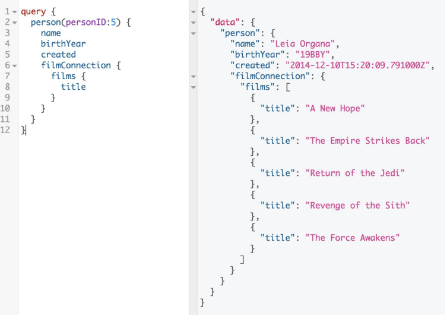

## 什么是GraphQL

[GraphQL](https://graphql.org/) 是一种用于 API 的查询语言。它也是一个运行时，填充数据以完成你的查询。GraphQL 服务与传输无关，但通常通过 HTTP 提供服务。

为了演示 GraphQL 查询及其响应，让我们看一下星球大战 API [SWAPI](https://graphql.org/swapi-graphql/)。SWAPI 是一种用 GraphQL 封装的具象状态传输 (REST) API。我们可以用它来发送查询和接收数据。

GraphQL 查询只询问它需要的数据。图 1-1 是一个 GraphQL 查询的例子。查询在左侧。我们请求一个人的数据，Leia 公主。我们获得了 Leia Organa 的记录，因为我们指定我们想要第五个人 (personID:5)。接下来，我们要求三个数据字段：姓名、出生年份和创建时间。右边是我们的响应：格式化为匹配我们查询的形状的 JSON 数据。此响应仅包含我们需要的数据。
<p align="center">
  <br>
  图1-1 星球大战 API中的用户查询<br>
</p>

然后我们可以调整查询，因为查询是交互式的。我们可以改变它并看到一个新的结果。如果我们添加字段 filmConnection，我们可以请求 Leia 的每部电影的标题，如图 1-2 所示。
<p align="center">
  <br>
  图1-2 连接查询<br>
</p>

查询是嵌套的，执行时可以遍历相关对象。这允许我们为两种类型的数据发出一个 HTTP 请求。我们不需要多次往返来深入研究多个对象。我们不会收到有关这些类型的其他不需要的数据。使用 GraphQL，我们的客户可以在一个请求中获得他们需要的所有数据。

每当针对 GraphQL 服务器执行查询时，都会根据类型系统对其进行验证。每个 GraphQL 服务都在 GraphQL 模式中定义类型。您可以将类型系统视为 API 数据的蓝图，后面是您定义的对象列表。例如，前面的 person 查询由 Person 对象支持：

``` javascript
type Person {
  id: ID!
  name: String
  birthYear: String
  eyeColor: String
  gender: String
  hairColor: String
  height: Int
  mass: Float
  skinColor: String
  homeworld: Planet
  species: Species
  filmConnection: PersonFilmsConnection
  starshipConnection: PersonStarshipConnection
  vehicleConnection: PersonVehiclesConnection
  created: String
  edited: String
}
```

Person 类型定义了可用于在 Princess Leia 上查询的所有字段及其类型。在[第 3 章](/ch03_00.md)中，我们深入探讨了模式和 GraphQL 的类型系统。

GraphQL 通常被称为声明式数据获取语言。也就是说，我们的意思是开发人员会将他们的数据需求列为他们需要的数据，而不关注他们将如何获得它。GraphQL 服务器库以多种不同的语言存在，包括 C#、Clojure、Elixir、Erlang、Go、Groovy、Java、JavaScript、.NET、PHP、Python、Scala 和 Ruby。

在本书中，我们重点关注如何使用 JavaScript 构建 GraphQL 服务。我们在本书中讨论的所有技术都适用于任何语言的 GraphQL。

### GraphQL 规范

GraphQL 是客户端-服务器通信的规范（spec）。什么是规范？ 规范描述了一种语言的能力和特征。我们受益于语言规范，因为它们为社区使用语言提供了通用词汇和最佳实践。

一个相当著名的软件规范示例是 ECMAScript 规范。每隔一段时间，来自浏览器公司、科技公司和整个社区的一组代表就会聚在一起，设计出 ECMAScript 规范中应该包含（和排除）的内容。GraphQL 也是如此。一群人聚在一起写下了语言中应该包含（和排除）的内容。这是所有 GraphQL 实现的指南。

规范发布时，GraphQL 的创建者还共享了 JavaScript 中 GraphQL 服务器的参考实现——[graphql.js](https://github.com/graphql/graphql-js)。这作为一个蓝图很有用，但这个参考实现的目标不是强制你使用哪种语言来实现你的服务。这只是一个指南。了解查询语言和类型系统后，您可以使用任何您喜欢的语言构建您的服务器。

如果规范和实现不同，那么规范中的实际内容是什么？ 该规范描述了您在编写查询时应使用的语言和语法。它还设置了一个类型系统以及该类型系统的执行和验证引擎。除此之外，规范并不是特别独裁。GraphQL 不规定使用哪种语言、数据应如何存储或支持哪些客户端。查询语言有指导原则，但项目的实际设计取决于您。（如果您想深入了解整个事情，可以浏览[文档](http://facebook.github.io/graphql)。）

### GraphQL 设计原则
尽管 GraphQL 无法控制您构建 API 的方式，但它确实提供了一些关于如何考虑服务的指南：

**分层的**

GraphQL 查询是分层的。字段嵌套在其他字段中，查询的形状类似于它返回的数据。

**以产品为中心**

GraphQL 由客户端的数据需求以及支持客户端的语言和运行时驱动。

**强类型**

GraphQL 服务器由 GraphQL 类型系统支持。在模式中，每个数据点都有一个特定的类型，它将根据该类型进行验证。

**客户定制查询**

GraphQL 服务器提供允许客户端使用的功能。

**可检视**

GraphQL 语言能够查询 GraphQL 服务器的类型系统。

现在我们已经对 GraphQL 规范有了一个初步的了解，让我们看看 GraphQL 的来源。

| :point_left: [上一节](/ch01_00.md) | [下一节](/ch01_02.md) :point_right: |
| - | - |
