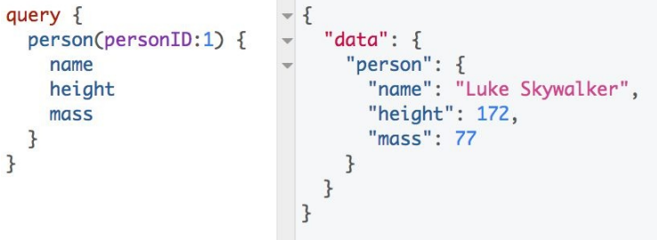
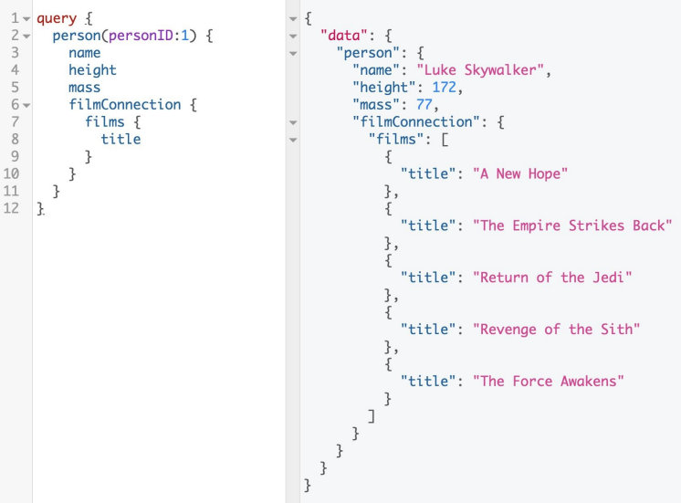

## REST的缺点

当 GraphQL 首次发布时，有人将其吹捧为 REST 的替代品。“REST 已死！” 早期采用者哭喊着，然后鼓励我们所有人向后备箱扔一把铲子，把我们毫无戒心的 REST API 赶到树林里。这对于获得博客点击和在会议上开始对话非常有用，但是将 GraphQL 描绘成 REST 杀手是过于简单化了。更微妙的看法是，随着网络的发展，REST 在某些条件下显示出紧张的迹象。GraphQL 旨在缓解压力。

### 过度获取

假设我们正在构建一个使用来自 REST 版本的 SWAPI 的数据的应用程序。首先，我们需要加载有关 1 号角色 Luke Skywalker 的一些数据。我们可以通过访问 [https://swapi.co/api/people/1/](https://swapi.co/api/people/1/) 对这些信息进行 GET 请求，响应是这个 JSON 数据：

``` json
{
  "name": "Luke Skywalker",
  "height": "172",
  "mass": "77",
  "hair_color": "blond",
  "skin_color": "fair",
  "eye_color": "blue",
  "birth_year": "19BBY",
  "gender": "male",
  "homeworld": "https://swapi.co/api/planets/1/",
  "films": [
    "https://swapi.co/api/films/2/",
    "https://swapi.co/api/films/6/",
    "https://swapi.co/api/films/3/",
    "https://swapi.co/api/films/1/",
    "https://swapi.co/api/films/7/"
  ],
  "species": ["https://swapi.co/api/species/1/"],
  "vehicles": [
    "https://swapi.co/api/vehicles/14/",
    "https://swapi.co/api/vehicles/30/"
  ],
  "starships": [
    "https://swapi.co/api/starships/12/",
    "https://swapi.co/api/starships/22/"
  ],
  "created": "2014-12-09T13:50:51.644000Z",
  "edited": "2014-12-20T21:17:56.891000Z",
  "url": "https://swapi.co/api/people/1/"
}
```

这是一个巨大的响应。响应超出了我们应用程序的数据需求。我们只需要姓名、质量和身高的信息：

``` json
{
  "name": "Luke Skywalker",
  "height": "172",
  "mass": "77"
}
```

这是一个明显的过度获取案例——我们得到了很多我们不需要的数据。客户端需要三个数据点，但我们取回了一个有 16 个 key 的对象，并通过网络发送了无用的信息。在 GraphQL 应用程序中，这个请求看起来如何？ 在图 1-3 中，我们仍然需要 Luke Skywalker 的名字、身高和质量。
<p align="center">
  <br>
  图1-3 查询Luke Skywalker<br>
</p>

在左侧，我们发出 GraphQL 查询。我们只请求我们想要的字段。在右边，我们收到一个 JSON 响应，这次只包含我们请求的数据，而不是无缘无故地从手机信号塔传输到手机所需的 13 个额外字段。我们请求哪些数据，我们就只收到这些的数据。仅此而已。这更具声明性，并且可能会在不获取无关数据的情况下产生更快的响应。

### 获取不足

我们的项目经理刚出现在我们的办公桌前，想为 Star Wars 应用程序添加另一个功能。除了姓名、身高和体重之外，我们现在还需要显示 Luke Skywalker 参演的所有电影的片名列表。在我们从 [https://swapi.co/api/people/1/](https://swapi.co/api/people/1/) 请求数据后，我们仍然需要额外请求更多数据。这意味着我们获取不足。

为了获得每部电影的片名，我们需要从电影数组中的每条路由中获取数据：

```
"films": [
  "https://swapi.co/api/films/2/",
  "https://swapi.co/api/films/6/",
  "https://swapi.co/api/films/3/",
  "https://swapi.co/api/films/1/",
  "https://swapi.co/api/films/7/"
]
```

获取此数据需要对 Luke Skywalker(https://swapi.co/api/people/1/) 发出一个请求，然后对每部电影再发出五个请求。对于每部电影，我们都会得到另一个大的对象。这次我们只用到一个值。

``` json
{
  "title": "The Empire Strikes Back",
  "episode_id": 5,
  "opening_crawl": "...",
  "director": "Irvin Kershner",
  "producer": "Gary Kurtz, Rick McCallum",
  "release_date": "1980-05-17",
  "characters": [
    "https://swapi.co/api/people/1/",
    "https://swapi.co/api/people/2/",
    "https://swapi.co/api/people/3/",
    "https://swapi.co/api/people/4/",
    "https://swapi.co/api/people/5/",
    "https://swapi.co/api/people/10/",
    "https://swapi.co/api/people/13/",
    "https://swapi.co/api/people/14/",
    "https://swapi.co/api/people/18/",
    "https://swapi.co/api/people/20/",
    "https://swapi.co/api/people/21/",
    "https://swapi.co/api/people/22/",
    "https://swapi.co/api/people/23/",
    "https://swapi.co/api/people/24/",
    "https://swapi.co/api/people/25/",
    "https://swapi.co/api/people/26/"
  ],
  "planets": [
    //... Long list of routes
  ],
  "starships": [
    //... Long list of routes
  ],
  "vehicles": [
    //... Long list of routes
  ],
  "species": [
    //... Long list of routes
  ],
  "created": "2014-12-12T11:26:24.656000Z",
  "edited": "2017-04-19T10:57:29.544256Z",
  "url": "https://swapi.co/api/films/2/"
}
```

如果我们想列出这部电影中的角色，我们需要提出更多的要求。在这种情况下，我们需要多走 16 条路线并与客户端进行 16 次以上的往返。每个 HTTP 请求都使用客户端资源并过度获取数据。结果是用户体验变慢，网络速度较慢或设备较慢的用户可能根本无法查看内容。

GraphQL 解决获取不足问题的方法是定义一个嵌套查询，然后在一次获取中请求所有数据，如图 1-4 所示。

<p align="center">
  <br>
  图1-4 电影连接<br>
</p>

在这里，我们只收到了请求中需要的数据。而且，一如既往，查询的数据与返回数据的格式相匹配。

### 管理 REST 端点

关于 REST API 的另一个常见抱怨是缺乏灵活性。随着客户端需求的变化，您通常必须创建新的端点，而这些端点可能会开始迅速增加。用奥普拉的话说，“你找到了一条路由！ 你得到一个路由！ 每一个！ 人！ 得到！ 一个！ 路由！”

使用 SWAPI REST API，我们必须向许多路由发出请求。较大的应用程序通常使用自定义端点来最小化 HTTP 请求。您可能会看到像这样的端点 ```/api/character-with-movie-title```开始出现。开发速度可能会很慢，因为设置新的端点通常意味着前端和后端团队有更多的计划和沟通要做。

使用 GraphQL，典型的架构包含一个端点。单个端点可以充当网关并编排多个数据源，而且单个端点仍然使数据组织更加容易。

在讨论 REST 缺点时，请务必注意许多组织同时使用 GraphQL 和 REST。设置从 REST 端点获取数据的 GraphQL 端点是使用 GraphQL 的一种完全有效的方式。这可能是在您的组织中逐步采用 GraphQL 的好方法。

| :point_left: [上一节](/ch01_03.md) | [下一节](/ch01_05.md) :point_right: |
| - | - |
