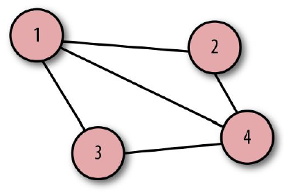
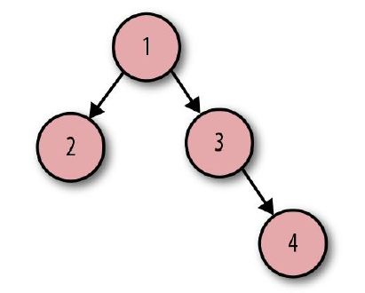
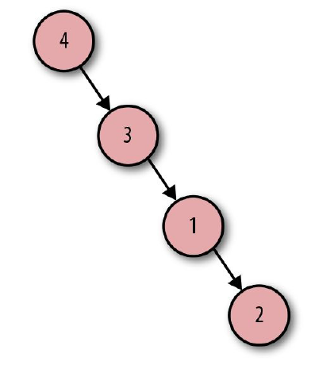

## 图论
铃声响起，你拿起手机。关掉铃声后，你看到两条消息：十五个人赞了你昨天写的推文；三个人转发了它。很好，一瞬间的推特恶名是由“图”（参考图2-1）带给你的。  
<p align="center">
  <br>
  图2-1 推特的“赞”和“转发”<br>
</p>
  
在 Irving Park 站，你跑上楼去搭乘L线（译注：芝加哥高速铁路）。在车门关上之前，你跳进车厢。完美，列车摇摇晃晃向前行进，连接每一座站台。  
一站又一站，门开了又关。依次经过 Addison, Paulina, Southport 和 Belmont。在 Belmont 站，你穿过站台换乘 Red Line。又过了两站：Fullerton 和 North/Clybourn。这张“图”带你到工作地点，参考图2-2。  
<p align="center">
  <br>
  图2-2 芝加哥“L”线<br>
</p>
  
在乘坐电梯到地面层的时候，你的手机铃声响起。是你的姐姐，她说想买一张票，在七月份去参加家里老人80岁的生日。你问道：“爷爷还是姥爷？”“爷爷，但我认为姥姥和姥爷可能也会去。还有 Linda 阿姨和 Steve 叔叔。”这个聚会是由另一个“图”衍生出来的：家谱。图2-3展示了这张“图”。  
<p align="center">
  <br>
  图2-3 家谱<br>
</p>
  
不久之后，你开始注意到无处不在的“图”。在社交媒体APP、路线图和日常电话里的家人。还有浩瀚的星辰大海，如图2-4。  
<p align="center">
  <br>
  图2-4 北斗星<br>
</p>
  
还有自然界中最小的积木，参考图2-5。
<p align="center">
  <br>
  图2-5 H2O分子<br>
</p>
  
“图”就在我们身边，因为这是一种绘制关联元素、人、想法或数据的很棒的方式。“图”的概念从何而来呢？为了了解这个，我们要进一步了解图论在数学中的起源。  
  
> **_Note_**  
> 你不需要知道图论的任何知识就可以成功使用GraphQL，这不是一个考试。然而我们认为通过探索这些概念的历史，了解一些额外的背景知识是很有趣的。  
</kbd>

### 图论词汇
图论是对图的研究。图正式用于表示一些互相关联的对象的集合。你可以认为图包含了一些数据点和数据点之间的关联关系。在计算机科学领域，图通常用于描述数据网络。一张图可能看起来像图2-6。  
<p align="center">
  <br>
  图2-6 图<br>
</p>

这张图由四个圆组成，每个圆表示一个数据点。在图论术语中，这些点被称作节点或定点。图中节点之间的五根线被称作边。  
图可以表示为方程式 G = (V, E) 。  
从最简单的缩写开始，G（Graph）表示图，V（Vertices）描述了顶点或节点的集合。在这张图中，V 等价于：  
```
vertices = {1, 2, 3, 4}
```
E（Edges）表示边的集合。每条边可以用一对节点表示。
```
edges = { {1, 2},
          {1, 3},
          {1, 4},
          {2, 4},
          {3, 4}}
```
在这些边中，如果我们重新排列顺序会怎样？例如：  
```
edges = { {4, 3},
          {4, 2},
          {4, 1},
          {3, 1},
          {2, 1}}
```
在这种情况下，图没有变化，参考图2-7。  
<p align="center">
  <br>
  图2-7 图<br>
</p>

该表达式仍然同一张图，是因为在节点之间没有方向或层级关系。在图论中，我们把这种图称为无向图。边，即数据节点间的连接，的定义是的无序数值对。  
当遍历或浏览这张图上的不同节点时，你可以从任意节点开始，以任意方向浏览到任意节点结束。数据没有明显的顺序，因此，无向图是一个非线性数据结构。让我们看看另一种类型的图，即有向图，如图2-8所示。  
<p align="center">
  <br>
  图2-8 有向图<br>
</p>

在这张图里，节点数量相同，但是边看上去不同。这里的直线被加上了箭头。节点之间有一个方向或者说流向。我们用下面这种方式表达：  
```
vertices = {1, 2, 3, 4}
   edges = ({1, 2},
            {1, 3},
            {3, 4})
```
把它们整合到一起，图的表达式可以写成这样：  
```
graph = ({1, 2, 3, 4},
         ({1, 2}, {1, 3}, {3, 4}))
```
注意这里的数值被包含在小括号（圆括号）而不是大括号（花括号）中。小括号表示这些边被定义为有序的数值对。当这些边是有序数值对的时候，我们得到一个有方向的图，即有向图。此时，如果重新排列这些有序数值对，会发生什么？我们的图会和无向图一样没有变化吗？  
```
graph = ({1, 2, 3, 4},
         ({4, 3}, {3, 1}, {1, 2}))
```
结果看起来和原来不一样，节点4变成了根结点，如图2-9所示。  
<p align="center">
  <br>
  图2-9 有向图<br>
</p>
遍历这张图时，你需要从节点4开始，沿着箭头依次访问每个节点。为了使遍历可视化，把从一个节点到另一个节点的物理浏览绘成一张图会很有用。实际上，图论概念的起源就是物理浏览。  

### 图论历史
TODO：
### 树即是图
TODO：
### 现实世界中的图
TODO：
