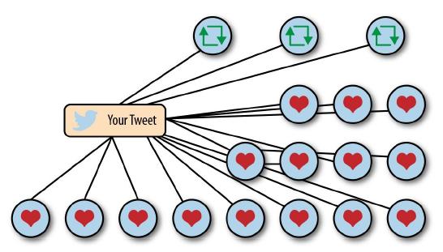
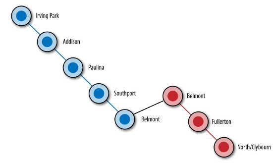
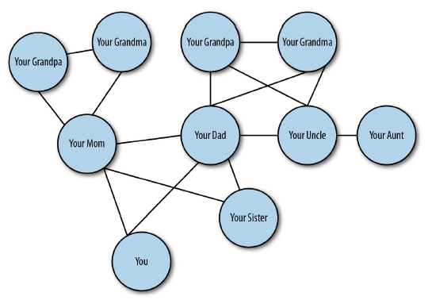
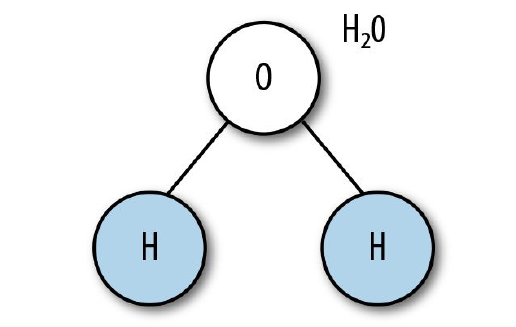

## 图论
铃声响起，你拿起手机。关掉铃声后，你看到两条消息：十五个人赞了你昨天写的推文；三个人转发了它。很好，一瞬间的推特恶名是由“图”（参考图2-1）带给你的。  

   
  图2-1 推特的“赞”和“转发” 

  
在 Irving Park 站，你跑上楼去搭乘L线（译注：芝加哥高速铁路）。在车门关上之前，你跳进车厢。完美，列车摇摇晃晃向前行进，连接每一座站台。  
一站又一站，门开了又关。依次经过 Addison, Paulina, Southport 和 Belmont。在 Belmont 站，你穿过站台换乘 Red Line。又过了两站：Fullerton 和 North/Clybourn。这张“图”带你到工作地点，参考图2-2。  

   
  图2-2 芝加哥“L”线 

  
在乘坐电梯到地面层的时候，你的手机铃声响起。是你的姐姐，她说想买一张票，在七月份去参加家里老人80岁的生日。你问道：“爷爷还是姥爷？”“爷爷，但我认为姥姥和姥爷可能也会去。还有 Linda 阿姨和 Steve 叔叔。”这个聚会是由另一个“图”衍生出来的：家谱。图2-3展示了这张“图”。  

   
  图2-3 家谱 

  
不久之后，你开始注意到无处不在的“图”。在社交媒体APP、路线图和日常电话里的家人。还有浩瀚的星辰大海，如图2-4。  

   
  图2-4 北斗星 

  
还有自然界中最小的积木，参考图2-5。

   
  图2-5 H2O分子 

  
“图”就在我们身边，因为这是一种绘制关联元素、人、想法或数据的很棒的方式。“图”的概念从何而来呢？为了了解这个，我们要进一步了解图论在数学中的起源。  
  
> **_Note_**  
> 你不需要知道图论的任何知识就可以成功使用GraphQL，这不是一个考试。然而我们认为通过探索这些概念的历史，了解一些额外的背景知识是很有趣的。  

| :point_left: [上一节](/ch01_00.md) | [下一节](/ch02_01.md) :point_right: |
| - | - |
