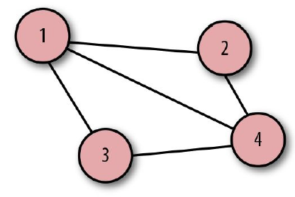
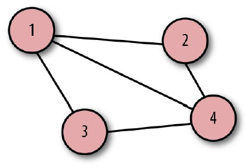
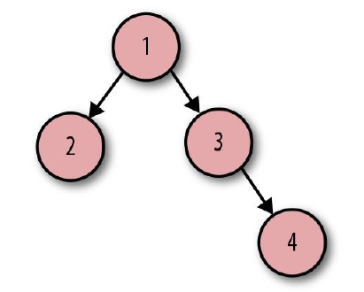
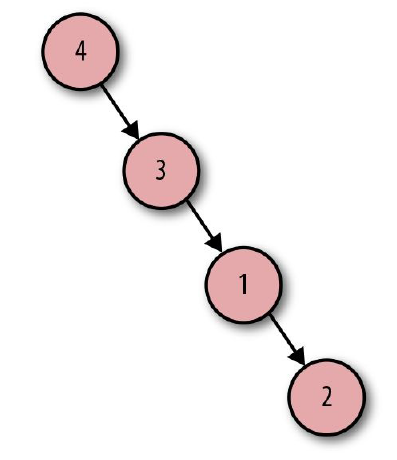

## 图论词汇
图论是对图的研究。图正式用于表示一些互相关联的对象的集合。你可以认为图包含了一些数据点和数据点之间的关联关系。在计算机科学领域，图通常用于描述数据网络。一张图可能看起来像图2-6。
<p align="center">
  <br>
  图2-6 图<br>
</p>

这张图由四个圆组成，每个圆表示一个数据点。在图论术语中，这些点被称作节点或定点。图中节点之间的五根线被称作边。
图可以表示为方程式 G = (V, E) 。
从最简单的缩写开始，G（Graph）表示图，V（Vertices）描述了顶点或节点的集合。在这张图中，V 等价于：  
```javascript
vertices = {1, 2, 3, 4}
```

E（Edges）表示边的集合。每条边可以用一对节点表示。
```javascript
edges = { {1, 2},
          {1, 3},
          {1, 4},
          {2, 4},
          {3, 4}}
```

在这些边中，如果我们重新排列顺序会怎样？例如：  
```javascript
edges = { {4, 3},
          {4, 2},
          {4, 1},
          {3, 1},
          {2, 1}}
```

在这种情况下，图没有变化，参考图2-7。
<p align="center">
  <br>
  图2-7 图<br>
</p>

该表达式仍然同一张图，是因为在节点之间没有方向或层级关系。在图论中，我们把这种图称为无向图。边，即数据节点间的连接，的定义是的无序数值对。
当遍历或浏览这张图上的不同节点时，你可以从任意节点开始，以任意方向浏览到任意节点结束。数据没有明显的顺序，因此，无向图是一个非线性数据结构。让我们看看另一种类型的图，即有向图，如图2-8所示。
<p align="center">
  <br>
  图2-8 有向图<br>
</p>

在这张图里，节点数量相同，但是边看上去不同。这里的直线被加上了箭头。节点之间有一个方向或者说流向。我们用下面这种方式表达：  
```javascript
vertices = {1, 2, 3, 4}
   edges = ({1, 2},
            {1, 3},
            {3, 4})
```

把它们整合到一起，图的表达式可以写成这样：  
```javascript
graph = ({1, 2, 3, 4},
         ({1, 2}, {1, 3}, {3, 4}))
```

注意这里的数值被包含在小括号（圆括号）而不是大括号（花括号）中。小括号表示这些边被定义为有序的数值对。当这些边是有序数值对的时候，我们得到一个有方向的图，即有向图。此时，如果重新排列这些有序数值对，会发生什么？我们的图会和无向图一样没有变化吗？  
```javascript
graph = ({1, 2, 3, 4},
         ({4, 3}, {3, 1}, {1, 2}))
```

结果看起来和原来不一样，节点4变成了根结点，如图2-9所示。
<p align="center">
  <br>
  图2-9 有向图<br>
</p>
遍历这张图时，你需要从节点4开始，沿着箭头依次访问每个节点。为了使遍历可视化，把从一个节点到另一个节点的物理浏览绘成一张图会很有用。实际上，图论概念的起源就是物理浏览。

<p align="center"></p>

| :point_left: [上一节](/ch02_00.md) | [下一节](/ch02_02.md) :point_right: |
| - | - |
