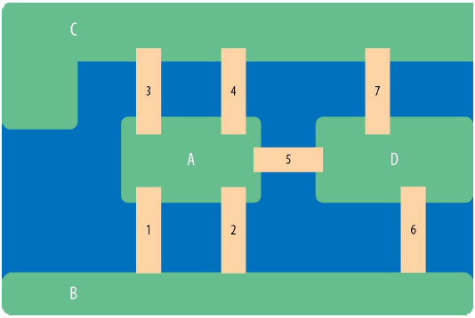
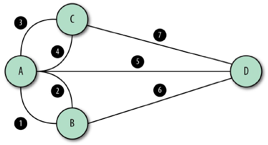
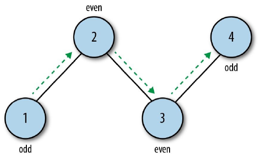
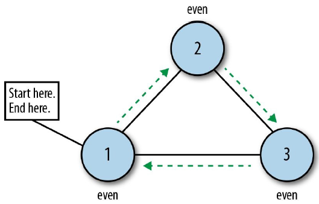

### 图论历史
我们可以将研究图论的历史追溯到1735年普鲁士的[哥尼斯堡镇](http://bit.ly/2AQhU47)。这个镇位于普莱格尔河上，是一个航运枢纽，包括两个大岛在内的四块陆地，由七座桥连接，如图2-10所示。

   
  图2-10 哥尼斯堡桥 

  
哥尼斯堡是一个美丽的小镇，镇上的人们喜欢在周末在桥上散步，享受清新的空气。随着时间过去，镇上的人们开始执迷于解决一个难题：怎么才能走遍所有的桥，同时每座桥只走一次？他们在小镇里试图走到每个岛屿，同时又不穿过重复的桥，但最后都失败了。他们求助于莱昂哈德·欧拉希望能解决这个问题。欧拉是一位多产的数学家，在他的一生中，出版了500多本书和论文。
  
作为一个忙碌的天才，欧拉一开始并不关心这个微不足道的小问题。但当他思考了一段时间后，欧拉像镇上的居民一样有兴趣，并狂热地想弄清楚这个问题。欧拉决定把这个问题简化为“连接”（桥）在陆地之间的问题，而不是写出每一条可能的路径，如图2-11所示。

   
  图2-11 标了数值的哥尼斯堡桥 

  
然后他通过简化桥和陆地的关系，画出了“图”的雏形，如图2-12。

   
  图2-12 “图”形态的哥尼斯堡桥 

  
在图2-12中，节点A和B相邻，因为他们可以通过某条边连接。使用这些互相连接的边，我们可以计算每个节点的“度”。每个节点的“度”等于连接节点的边数。如果以这样的角度看哥德斯堡桥的问题，我们会发现每个节点的“度”都是奇数。
* A：5条边到邻接节点（奇数）
* B：3条边到邻接节点（奇数）
* C：3条边到邻接节点（奇数）
* D：3条边到邻接节点（奇数）
  
因为每个节点的度都是奇数，欧拉发现穿过每座桥，同时不穿过重复的桥是不可能的。长话短说：如果你穿过某座桥来到了一个岛上，你必须从另一座桥离开。如果你不想重复穿过一座桥，桥的数量就必须是偶数。  
今天，我们把可以一次穿过每条边的图称作欧拉路径。如果要满足这个条件，无向图需要有两个节点的度为奇数或者所有的节点的度为偶数。这里，我们有两个度为奇数的顶点 (1, 4)，如图2-13所示。

   
  图2-13 欧拉路径 

  
关于欧拉的另一个想法是欧拉回路。在这种情况下，开始节点就是结束节点。每条边只访问一次，但是开始节点和结束节点是重复的（图2-14）。

   
  图2-14 欧拉循环 

  
哥德斯堡桥难题成为图论的第一个定理。除了被认为是图论的创始人之外，欧拉还因为创造了自然常数 e 和虚数单位 i 而被人们所熟知。即使是数学函数语法 f(x)，即将函数 f 作用于变量 x，也可以被追溯到莱昂哈德·欧拉。  
哥德斯堡桥难题已经被证明不能一次通过。从来没有规则要求必须从哪个节点开始或结束。这意味着尝试解决这个问题是一个遍历无向图的练习。如果你想尝试解决桥的问题，但必须从指定节点开始，该怎么办？  
如果你住在 B 岛，也就意味着你必须从 B 岛开始自己的旅程。在这种情况下，你就是在解决一个有向图的问题，通常被称为“树”。  
  
| :point_left: [上一节](/ch02_01.md) | [下一节](/ch02_03.md) :point_right: |
| - | - |
