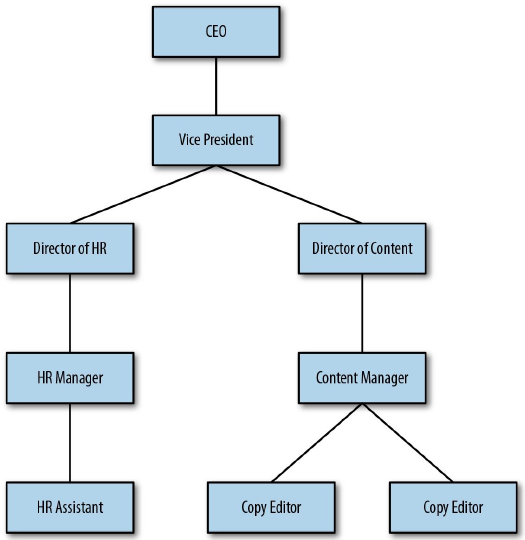
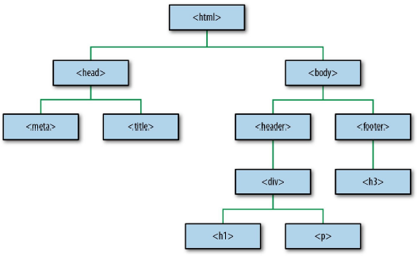
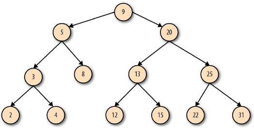

## 树即是图
让我们考虑另一种类型的图：树。树是节点分层次排列的图。你知道树有根结点。换句话说，根结点是树的起点，所有其它节点作为子节点链接到根结点上。
考虑一张组织结构图。这是一个树，CEO在最顶端，所有其他员工在CEO的下面。CEO是树的根结点，所有其它节点是树的子节点，参考图2-15。

   
  图2-15 组织结构图 

树有很多用处。你可以用树表示一个家谱。树可以映射为决策逻辑。在数据库中，树帮助更快更有效地访问数据。某天，考官面前的你甚至可能在在白板上手写如何翻转二叉树，而你的新工作从来不会用到他们。
我们可以根据是否有一个根结点或是否从某个节点开始开始判断一个图是不是树。从根结点出发，树可以通过边连接到子节点。当某个节点连接到子节点的时候，这个节点被称作父节点。当一个节点有多个子节点的时候，这个节点被称作分支。当一个节点没有子节点，被称作叶子节点。
节点可以包含数据。因为这个原因，了解数据在树中的位置以便快速访问它十分重要。为了快速找到数据，我们要计算出每个独立节点的深度。节点的深度可以简单理解为这个节点距离树的根结点有多远。让我们考虑树 A → B → C → D。数一数节点C到根结点（A）之间的边的数量可以找到节点C的深度。，所以节点C的深度是2，节点D的深度是3。
树的层次结构通常意味着树包括其他的树。嵌套到另一棵树中的树，被称作子树。HTML页面通常有多个子树。树的根结点是<html>标签。它有两个子树，左边子树的根结点是&lt;head&gt;，右边子树的根结点是&lt;body&gt;。从这开始，&lt;header&gt;、&lt;footer&gt;和&lt;div&gt;是不同子树的根结点。嵌套越多，子树也就越多，参考图2-16。

   
  图2-16 HTML树 

  
正如树是一种特殊类型的图，二叉树是一种特殊类型的树。一个二叉树意思是每个节点最多包含两个子节点。当我们讨论二叉树的时候，我们更多讨论的是二叉搜索树。一个二叉搜索树是符合特殊排序规则的二叉树。排序规则和树结构帮我们快速找到我们需要的数据。图2-17展示了一个二叉搜索树的例子。

   
  图2-17 二叉搜索树 

  
它有一个根结点，并且满足每个节点最多有两个子节点的规则。假如我们想找到节点15，没有二叉搜索树的时候，我们需要访问每一个节点，直到找到15为止。也许我们很幸运直接找到了正确的分支。也许我们不幸运，需要低效地在树里回溯才能找到。
有了二叉搜索树，我们可以通过理解“左右规则”来有技巧地定位节点15。如果我们从根结点9开始遍历，我们问：“15比9大吗？”如果比9小，我们去左边找。如果比9大，我们去右边找。15大于9，所以我们来到右边，这样，我们就排除了树的一半节点。从这开始，我们看到了节点20,。15比20大吗？15比20小，所以我们向左边找，这样就消除掉了剩余节点的一半。然后遇到节点13。15比13大吗？比13大，所以我们向右边找。然后就找到了15！通过使用左和右来消除选项，我们可以更快地找到我们感兴趣的数据。

| :point_left: [上一节](/ch02_02.md) | [下一节](/ch02_04.md) :point_right: |
| - | - |
