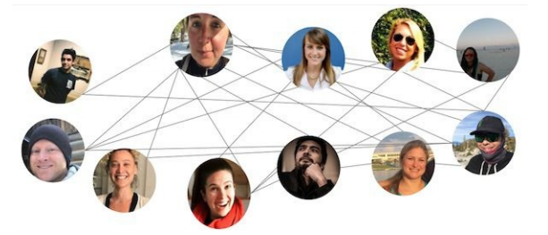

## 现实世界中的图
你可能每天都遇到这些图论概念，具体取决于你使用GraphQL所做的的工作。或者也许你使用GraphQL，作为一种有效的用户界面数据加载方式。无论如何，所有这些想法都在GraphQL项目的幕后运行。正如我们所看到的，一些拥有很多数据点的应用的需求，特别适合用图来处理。  
想想Facebook。根据我们的图论词汇表，我们知道Facebook的每个人是一个节点。当一个人关联到另一个人的时候，就有了一个通过边实现的双向的连接。Facebook是一个无向图。无论何时我联系到某人，他也会联系到我。我和最好的的朋友Sarah的连接，是一个双向连接。我们是彼此的好友（如图2-18所示）。
<p align="center">
  <br>
  图2-18 Facebook无向图<br>
</p>

作为一个无向图，Facebook图上的每个节点是多个互相连接的关系网的一部分——即一个社交网络。你可以连接到你所有的朋友。在同一张图中，这些朋友也连接到所有他们的朋友。遍历可以从任意节点开始或结束（如图2-19）。
<p align="center">
  <br>
  图2-19 Facebook无向网<br>
</p>

另外，我们来看看Twitter。和Facebook的人与人之间的双向连接不同，Twitter是一个有向图，因为每个连接都是单向的，如图2-10所示。如果你关注了Michelle Obama，她可能没有关注你，即使她总是欢迎这样做（[@eveporcello](https://twitter.com/eveporcello), [@moontahoe](https://twitter.com/moontahoe)）。
<p align="center">
  <br>
  图2-20 Twitter的图<br>
</p>

如果从某个人的角度，去看她所有的朋友，她就成为了树的根节点。她连接到她的朋友，她的朋友通过一些子树再连接到她朋友的朋友（如图2-21）。
<p align="center">
  <br>
  图2-21 朋友的树<br>
</p>

Facebook图中的其它人也一样。一旦你找到一个人，并请求他的朋友的数据，请求看起来就像一颗树。这个人是根结点，所有你从这个人拿到的数据是子节点。在这个请求中，这个人通过边和他的所有朋友连接。

- person
  - name
  - location
  - birthday
  - friends
    - friend name
    - friend location
    - friend birthday

```javascript
{
  me {
    name
    location
    birthday
    friends {
      name
      location
      birthday
    }
  }
}
```

使用GraphQL，通过对我们所需要的数据发出查询，对复杂的图数据进行简化。在下一章，我们将深入探索GraphQL查询的工作机理和如何针对类型系统进行查询的验证。

---

1. 更多关于节点和边的信息，可以查看Vaidehi Joshi的博客[《图论入门》](https://dev.to/vaidehijoshi/a-gentle-introduction-to-graph-theory)
2. 关于欧拉的和他的工作的更多信息在[这里](http://www.storyofmathematics.com/18th_euler.html)
3. 参考Vaidehi Joshi的博客[《二叉树》](http://bit.ly/2vQyKd5)

| :point_left: [上一节](/ch02_03.md) | [下一节](/ch03_00.md) :point_right: |
| - | - |
