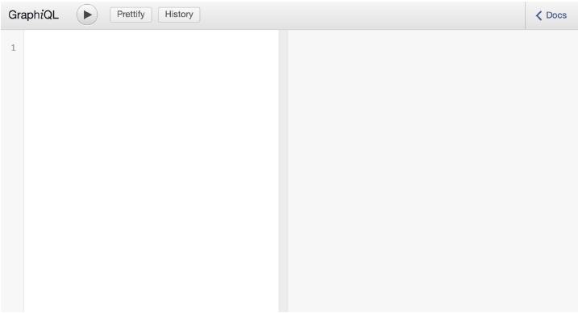
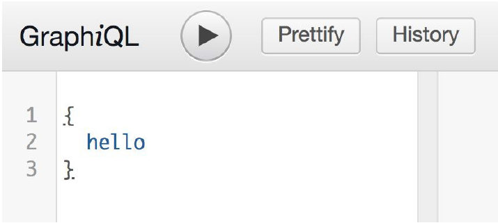
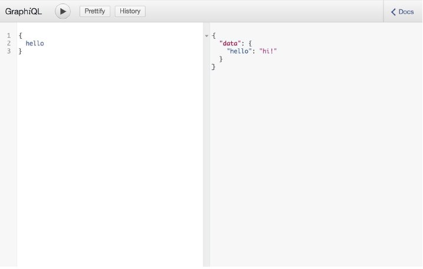
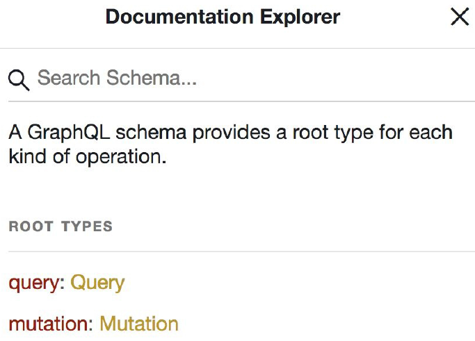
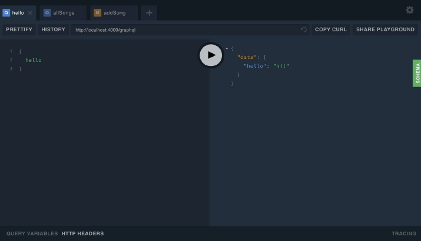
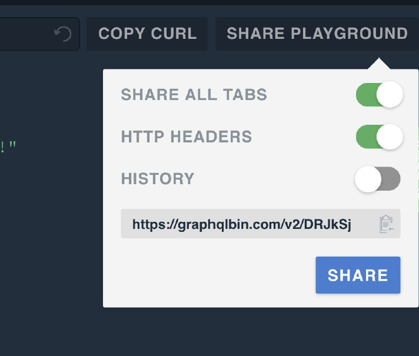

## GraphQL API 工具

GraphQL社区提供了几个开源工具，你可以用这些工具和GraphQL API交互。这些工具允许你写GraphQL查询，把这些查询发送到GraphQL终端，解析JSON格式的返回结果。在下一节，我们将介绍两个最受欢迎的的工具，用于针对GraphQL API测试GraphQL查询：GraphiQL和GraphQL Playground。  

### GraphiQL
GraphiQL是在Facebook中创建的一个浏览器内的集成开发环境（IDE），允许你查询和浏览GraphQL API。  
GraphiQL提供语法高亮、代码自动完成和错误警告，它支持你在浏览器内直接执行查询、查看查询结果。很多公开的API提供一个GraphiQL接口，你可以通过这个接口查询实时数据。
界面相当简单。你可以在一个面板中编辑查询，点击运行按钮运行查询，右侧是显示响应的面板，如图3-1所示。

<p align="center">
  <br>
  图3-1 GraphiQL页面<br>
</p>

我们的查询以GraphQL查询语言编写的文本开头。 我们将此文本称为查询文档。 您将查询文本放在左侧面板中。 GraphQL文档可以包含一个或多个操作。 操作是查询(Query)，Mutation或订阅(Subscription)。 图3-2显示了如何向文档添加Query操作。

<p align="center">
  <br>
  图3-2 一个GraphiQL查询<br>
</p>

点击运行按钮运行查询。然后，右侧面板中会收到一个格式化为JSON的响应结果（如图3-3）。

<p align="center">
  <br>
  图3-3 GraphiQL<br>
</p>

在右上角，可以点击打开文档窗口，文档窗口中定义了你和当前服务端交互需要知道的所有内容。这个文档会自动添加到GraphiQL中，因为它是从服务器的架构中读取的。架构定义了服务器上可用的数据，GraphiQL通过运行内省查询来自动构建文档。你始终可以在文档资源管理器中看到此文档，如图3-4所示。

<p align="center">
  <br>
  图3-4 GraphiQL文档资源管理器面板<br>
</p>

通常情况下，你可以通过URL访问GraphiQL，这个URL通常托管在GraphQL服务上。如果构建自己的GraphQL服务，你可以添加呈现GraphQL接口的路由并配置为公开，然后你的用户就可以通过这个接口浏览数据。你也可以下载一个独立版本的GraphiQL。

### GraphQL Playground
另外一个探索GraphQL API的工具是GraphQL Playground。GraphQL Playground由Prisma团队创建，它拥有GraphiQL的功能并在其基础上加了一些有趣的选项。和GraphQL Playground交互的最简单的方式是在浏览器中打开 [https://www.graphqlbin.com](https://www.graphqlbin.com) 。提供一个后端之后，你就可以使用Playground交互数据。  

GraphQL Playground和GraphiQL很像，但前者提供了几个你可能觉得很方便的额外的特性。最重要的特性是在你的GraphQL查询中发送自定义HTTP头的能力，如图3-5所示（在[第五章](ch05_00.md)介绍授权的时候，我们会详细讨论这个功能）。  

<p align="center">
  <br>
  图3-5 GraphQL Playground<br>
</p>

GraphQL Bin也是一个有趣的的协同工具，因为你可以把你的后端接口分享给别人，如图3-6所示。  

<p align="center">
  <br>
  图3-6 分享接口<br>
</p>

GraphQL Playground有一个桌面端版本，你可以使用Homebrew安装到本地：

```
brew cask install graphql-playground
```

或者，你也可以从这个[网站](http://bit.ly/graphql-pg-releases)下载。  
当你安装或导航到GraphQL Bin之后，你可以开始发送请求。在playground上粘贴API后端接口就可以快速开始。这个接口可以是一个公共API，也可以是运行在本地端口上的你的项目API。  

### 公有GraphQL API
最好的开始GraphQL的方式之一是在公共API中练习发送查询。几个公司和机构提供了一些GraphiQL接口，你可以使用它来查询公开数据：

##### [SWAPI](http://graphql.org/swapi-graphql)(星球大战-Star War API)
这是一个Facebook项目，它封装了 SWAPI REST API。

##### [GitHub API](https://developer.github.com/v4/explorer/)
最大的GraphQL API之一，GitHub GraphQL API允许你发送查询和mutation来查看和修改你的GitHub上的实时数据。你需要登录你的GitHub账户来和数据交互。  

##### [Yelp](https://www.yelp.com/developers/graphiql)
Yelp维护一个GraphQL API，你可以使用GraphQL进行查询。你需要创建一个Yelp开发者账户来和Yelp API中的数据交互。  

##### 更多其它[GraphQL API示例](https://github.com/APIs-guru/graphql-apis)

| :point_left: [上一节](/ch03_00.md) | [下一节](/ch03_02.md) :point_right: |
| - | - |
