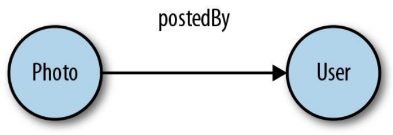
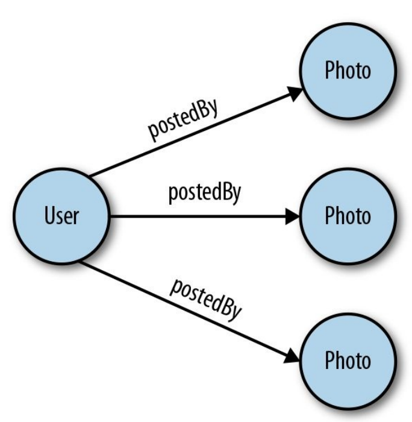
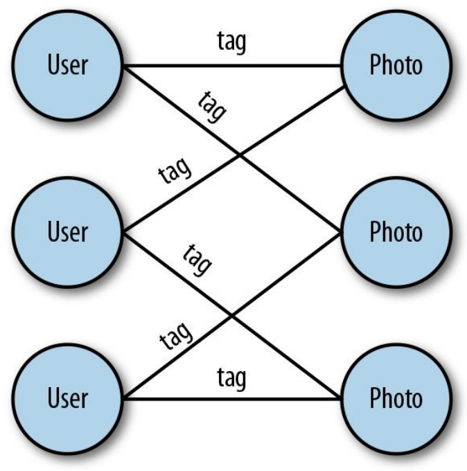

## 连接和列表

创建 GraphQL 模式时，您可以定义返回任何 GraphQL 类型列表的字段。列表是通过用方括号包围 GraphQL 类型来创建的。[String] 定义字符串列表，[PhotoCategory] 定义照片类别列表。正如[第 3 章](/ch03_00.md)所讨论的，如果我们合并联合或接口类型，列表也可以包含多种类型。我们将在本章末尾更详细地讨论这些类型的列表。

有时，感叹号在定义列表时可能有点棘手。当感叹号出现在右方括号之后时，表示该字段本身是不可空的。当感叹号出现在右方括号之前时，表示列表中包含的值不可为空。凡是看到感叹号的地方，都是必填项，不能返回null。表 4-1 定义了这些不同的情况。

| 列表声明 | 定义 |
| --- | --- |
| [Int] | 列表为空，列表中的元素为空 |
| [Int!] | 列表为空，列表中的元素不为空 |
| [Int]! | 列表不为空，列表中的元素为空 |
| [Int!]! | 列表不为空，列表中的元素不为空 |

表4-1 列表的可空规则

大多数列表定义都是不可空值的不可空列表。这是因为我们通常不希望列表中的值为空。我们应该提前过滤掉任何空值。如果我们的列表不包含任何值，我们可以简单地返回一个空的 JSON 数组； 例如， []。空数组在技术上不是空的：它只是一个不包含任何值的数组。

连接数据和查询多种类型相关数据的能力是一个非常重要的特性。当我们创建自定义对象类型的列表时，我们正在使用这一强大的功能并将对象相互连接起来。

在本节中，我们将介绍如何使用列表来连接对象类型。

### 一对一连接

当我们基于自定义对象类型创建字段时，我们连接了两个对象。在图论中，两个对象之间的连接或链接称为边。第一种连接类型是一对一连接，在这种连接中，我们将单个对象类型连接到另一个单个对象类型。

照片是由用户发布的，因此我们系统中的每张照片都应该包含一条边，将照片与发布照片的用户联系起来。图 4-1 显示了两种类型之间的单向连接：照片和用户。连接两个节点的边称为 postedBy。

<p align="center">
  <br>
  图4-1 一对一连接<br>
</p>

让我们看看我们如何在模式中定义它：

``` graphql
type User {
  githubLogin: ID!
  name: String
  avatar: String
}
type Photo {
  id: ID!
  name: String!
  url: String!
  description: String
  created: DateTime!
  category: PhotoCategory!
  postedBy: User!
}
```

首先，我们在我们的模式中添加了一个新类型，即用户。PhotoShare 应用程序的用户将通过 GitHub 登录。当用户登录时，我们获取他们的 githubLogin 并将其用作他们用户记录的唯一标识符。或者，如果他们将自己的姓名或照片添加到 GitHub，我们会将这些信息保存在名称和头像字段下。

接下来，我们通过向照片对象添加一个 postedBy 字段来添加连接。每张照片必须由用户发布，所以这个字段设置为用户！ 类型; 添加感叹号是为了使该字段不可为空。

### 一对多连接

尽可能让 GraphQL 的服务中的连接保持无向是个好主意。这为我们的客户提供了创建查询的最大灵活性，因为他们可以从任何节点开始遍历图形。要遵循这种做法，我们需要做的就是提供一条从用户类型返回到照片类型的路径。这意味着当我们查询一个用户时，我们应该看到特定用户发布的所有照片：

``` graphql
type User {
  githubLogin: ID!
  name: String
  avatar: String
  postedPhotos: [Photo!]!
}
```

通过将 postedPhotos 字段添加到 User 类型，我们提供了从用户返回照片的路径。postedPhotos 字段将返回照片类型列表，即用户发布的照片。因为一个用户可以发布多张照片，所以我们创建了一对多连接。如图 4-2 所示，一对多连接是在父对象包含列出其他对象的字段时创建的常见连接。

<p align="center">
  <br>
  图4-2 一对多连接<br>
</p>

添加一对多连接的常见位置是在我们的根类型中。为了使我们的照片或用户在查询中可用，我们需要定义我们的查询根类型的字段。让我们来看看如何将新的自定义类型添加到 Query 根类型：

``` graphql
type Query {
  totalPhotos: Int!
  allPhotos: [Photo!]!
  totalUsers: Int!
  allUsers: [User!]!
}
schema {
  query: Query
}
```

添加查询类型定义了我们的 API 中可用的查询。在此示例中，我们为每种类型添加了两个查询：一个用于提供每种类型的可用记录总数，另一个用于提供这些记录的完整列表。此外，我们已将查询类型作为文件添加到架构中。这使得我们的查询在我们的 GraphQL API 中可用。

现在可以使用以下查询字符串查询我们的照片和用户：

``` graphql
query {
  totalPhotos
  allPhotos {
    name
    url
  }
}
```

### 多对多连接

有时我们想将节点列表连接到其他节点列表。我们的 PhotoShare 应用程序将允许用户在他们发布的每张照片中识别其他用户。这个过程称为标记。一张照片可以包含多个用户，一个用户可以在多张照片中打上标签，如图4-3所示。

<p align="center">
  <br>
  图4-3 多对多连接<br>
</p>

要创建这种类型的连接，我们需要向用户和照片类型添加列表字段。

``` graphql
type User {
  ...
  inPhotos: [Photo!]!
}
type Photo {
  ...
  taggedUsers: [User!]!
}
```

如您所见，多对多连接由两个一对多连接组成。在这种情况下，一张照片可以有多个标记用户，一个用户可以在多张照片中标记。

### through类型

有时，在创建多对多关系时，您可能希望存储一些有关关系本身的信息。因为在我们的照片共享应用程序中没有真正需要通过类型，我们将使用不同的示例来定义through类型，即用户之间的 Friendship 。

我们可以通过在包含其他用户列表的用户下定义一个字段来将许多用户连接到许多用户：

``` graphql
type User {
  friends: [User!]!
}
```

在这里，我们为每个用户定义了一个好友列表。考虑这样一种情况，我们想保存一些关于 Friendship 本身的信息，比如用户彼此认识多长时间或他们在哪里见过面。

在这种情况下，我们需要将边定义为自定义对象类型。我们将此对象称为through类型，因为它是一个旨在连接两个节点的节点。让我们定义一个名为 Friendship 的 through 类型，我们可以用它来连接两个朋友，但也可以传递有关朋友如何连接的数据：

``` graphql
type User {
  friends: [Friendship!]!
}
type Friendship {
  friend_a: User!
  friend_b: User!
  howLong: Int!
  whereWeMet: Location
}
```

我们没有直接在其他用户类型的列表上定义朋友字段，而是创建了一个 Friendship 来连接朋友。Friendship 类型定义了两个连接的朋友：friend_a 和 friend_b。它还定义了一些关于朋友如何联系的详细字段：howLong 和 whereWeMet。howLong 字段是一个 Int，它将定义 Friendship 的长度，而 whereWeMet 字段链接到一个名为 Location 的自定义类型。

我们可以通过允许一群朋友成为 Friendship 的一部分来改进 Friendship 类型的设计。例如，也许你在一年级的同一时间遇到了你最好的朋友。我们可以通过添加一个名为 friends 的字段来允许两个或更多朋友成为 Friendship 的一部分：

``` graphql
type Friendship {
  friends: [User!]!
  how_long: Int!
  where_we_met: Location
}
```

我们只为 Friendship 中的所有朋友添加了一个字段。现在这个类型可以反映两个或更多的朋友。

### 不同类型的列表

在 GraphQL 中，我们的列表并不总是需要返回相同的类型。在[第 3 章](/ch03_00.md)中，我们介绍了联合类型和接口，并学习了如何使用片段为这些类型编写查询。让我们来看看如何将这些类型添加到我们的模式中。

在这里，我们将以时间表为例。您可能有一个由不同事件组成的计划，每个事件都需要不同的数据字段。例如，关于学习小组会议或锻炼的细节可能完全不同，但您应该能够将两者添加到日程表中。您可以将每日计划视为不同类型活动的列表。

我们可以通过两种方式为 GraphQL 中的计划定义模式：联合和接口。

#### 联合类型

在 GraphQL 中，联合类型是一种我们可以用来返回几种不同类型之一的类型。回想一下[第 3 章](/ch03_00.md)，我们如何编写一个名为 schedule 的查询来查询议程并在议程项目是锻炼时返回不同的数据，而不是在研究组时返回不同的数据。让我们在这里再看一遍：

``` graphql
query schedule {
  agenda {
    ...on Workout {
      name
      reps
    }
    ...on StudyGroup {
      name
      subject
      students
    }
  }
}
```

在学生的日常议程中，我们可以通过创建一个名为 AgendaItem 的联合类型来处理这个问题：

``` graphql
union AgendaItem = StudyGroup | Workout
type StudyGroup {
  name: String!
  subject: String
  students: [User!]!
}
type Workout {
  name: String!
  reps: Int!
}
type Query {
  agenda: [AgendaItem!]!
}
```

AgendaItem 将学习小组和训练结合在一种类型下。当我们将议程字段添加到我们的查询时，我们将其定义为锻炼或学习组的列表。

可以在一个并集下连接任意数量的类型。只需用管道符号分隔每种类型：

``` graphql
union = StudyGroup | Workout | Class | Meal | Meeting | FreeTime
```

#### 接口

另一种处理可能包含多种类型的字段的方法是使用接口。接口是可以由对象类型实现的抽象类型。接口定义了必须包含在实现它的任何对象中的所有字段。接口是在模式中组织代码的好方法。这确保某些类型始终包含可查询的特定字段，无论返回什么类型。

在[第 3 章](/ch03_00.md)中，我们编写了一个议程查询，该议程使用一个接口来返回日程表中不同项目的字段。让我们在这里回顾一下：

``` graphql
query schedule {
  agenda {
    name
    start
    end
    ... on Workout {
      reps
    }
  }
}
```

这是查询实现接口的议程的样子。对于与我们的日程表接口的类型，它必须包含所有议程项目将实现的特定字段。这些字段包括名称、开始和结束时间。不管你有什么类型的日程项目，他们都需要这些细节才能列在日程表上。

下面是我们如何在 GraphQL 模式中实现这个解决方案：

``` graphql
scalar DataTime
interface AgendaItem {
  name: String!
  start: DateTime!
  end: DateTime!
}
type StudyGroup implements AgendaItem {
  name: String!
  start: DateTime!
  end: DateTime!
  participants: [User!]!
  topic: String!
}
type Workout implements AgendaItem {
  name: String!
  start: DateTime!
  end: DateTime!
  reps: Int!
}
type Query {
  agenda: [AgendaItem!]!
}
```

在此示例中，我们创建了一个名为 AgendaItem 的接口。该接口是其他类型可以实现的抽象类型。当另一个类型实现一个接口时，它必须包含接口定义的字段。StudyGroup 和 Workout 都实现了 AgendaItem 接口，因此它们都需要使用名称、开始和结束字段。查询议程返回 AgendaItem 类型的列表。任何实现 AgendaItem 接口的类型都可以在议程列表中返回。

另请注意，这些类型也可以实现其他字段。StudyGroup 有一个主题和参与者列表，而 Workout 仍然有代表。您可以使用片段在查询中选择这些附加字段。

联合类型和接口都是可用于创建包含不同对象类型的字段的工具。由您决定何时使用一个或另一个。一般来说，如果对象包含完全不同的字段，使用联合类型是个好主意。他们非常有效。如果一个对象类型必须包含特定字段才能与另一种类型的对象交互，则您需要使用接口而不是联合类型。

| :point_left: [上一节](/ch04_01.md) | [下一节](/ch04_03.md) :point_right: |
| - | - |
