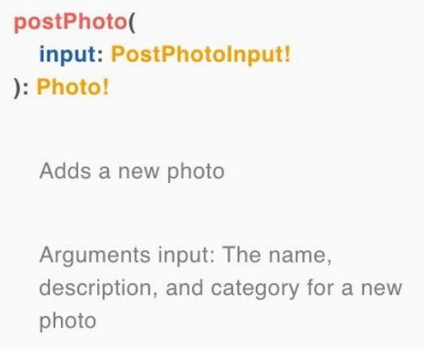

## 模式文档

[第 3 章](/ch03_00.md)解释了 GraphQL 如何拥有一个检视系统，该系统可以通知您服务器支持哪些查询。在编写 GraphQL 模式时，您可以为每个字段添加可选描述，这些描述将提供有关模式类型和字段的额外信息。提供描述可以让您的团队、您自己和 API 的其他用户更容易理解您的类型系统。

例如，让我们向模式中的用户类型添加注释：

``` graphql
"""
A user who has been authorized by GitHub at least once
"""
type User {
  """
  The user's unique GitHub login
  """
  githubLogin: ID!
  """
  The user's first and last name
  """
  name: String
  """
  A url for the user's GitHub profile photo
  """
  avatar: String
  """
  All of the photos posted by this user
  """
  postedPhotos: [Photo!]!
  """
  All of the photos in which this user appears
  """
  inPhotos: [Photo!]!
}
```

通过在每个类型或字段的评论上下添加三个引号，您可以为用户提供您的 API 的字典。除了类型和字段之外，您还可以记录参数。让我们看看 postPhoto 突变：

``` graphql
type Mutation {
  """
  Authorizes a GitHub User
  """
  githubAuth(
    "The unique code from GitHub that is sent to authorize the user"
    code: String!
  ): AuthPayload!
}
```

参数注释共享参数的名称以及该字段是否可选。如果您使用的是输入类型，则可以像记录任何其他类型一样记录这些：

``` graphql
"""
The inputs sent with the postPhoto Mutation
"""
input PostPhotoInput {
  "The name of the new photo"
  name: String!
  "(optional) A brief description of the photo"
  description: String
  "(optional) The category that defines the photo"
  category: PhotoCategory=PORTRAIT
}
postPhoto(
  "input: The name, description, and category for a new photo"
  input: PostPhotoInput!
): Photo!
```

然后，所有这些文档注释都列在 GraphQL Playground 或 GraphiQL 的架构文档中，如图 4-4 所示。当然，您也可以发出检视查询来查找这些类型的描述。

<p align="center">
  <br>
  图4-4 postPhoto 文档<br>
</p>

所有 GraphQL 项目的核心是一个可靠的、定义良好的模式。这作为前端和后端团队之间的路线图和合同，以确保构建的产品始终服务于模式。

在本章中，我们为照片共享应用程序创建了一个模式。在接下来的三章中，我们将向您展示如何构建一个全栈 GraphQL 应用程序来实现我们刚刚创建的模式的契约。

| :point_left: [上一节](/ch04_07.md) | [下一节](/ch05_00.md) :point_right: |
| - | - |
