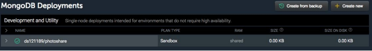

## 上下文

在本节中，我们将了解上下文，这是您可以存储任何解析器都可以访问的全局值的位置。上下文是存储身份验证信息、数据库详细信息、本地数据缓存以及解析 GraphQL 操作所需的任何其他内容的好地方。

您可以在解析器中直接调用 REST API 和数据库，但我们通常将该逻辑抽象为一个对象，我们将其放置在上下文中以强制分离关注点并允许以后更轻松地重构。您还可以使用上下文从 Apollo 数据源访问 REST 数据。有关这方面的更多信息，请查看[文档](http://bit.ly/2vac9ZC)中的 Apollo 数据源。

不过，出于我们的目的，我们现在将合并上下文以解决我们应用程序当前的一些限制。首先，我们将数据存储在内存中，这不是一个可扩展性很强的解决方案。我们还通过在每次突变时增加这些值来草率地处理 ID。相反，我们将依靠数据库来处理数据存储和 ID 生成。我们的解析器将能够从上下文中访问该数据库。

### 安装 Mongo

GraphQL 不关心你使用什么数据库。您可以使用 Postgres、Mongo、SQL Server、Firebase、MySQL、Redis、Elastic——任何您想要的。由于它在 Node.js 社区中的流行，我们将使用 Mongo 作为我们应用程序的数据存储解决方案。要开始在 Mac 上使用 MongoDB，我们将使用 Homebrew。要安装 Homebrew，请访问 https://brew.sh/ 。安装 Homebrew 后，我们将通过运行以下命令来完成安装 Mongo 的过程：

```
brew install mongo
brew services list
brew services start
```

成功启动MongoDB后，我们就可以开始对本地Mongo实例读写数据了。

> _**Windows 用户注意事项**_  
> 如果你想在 Windows 上运行本地版本的 MongoDB，请查看 http://bit.ly/inst-mdb-windows 。

您还可以使用像 mLab 这样的在线 Mongo 服务，如图 5-1 所示。您可以免费创建沙箱数据库。

<p align="center">
  <br>
  图5-1 mLab<br>
</p>

### 将数据库添加到上下文

现在是时候连接到我们的数据库并将连接添加到上下文了。我们将使用一个名为 mongodb 的包来与我们的数据库进行通信。我们可以使用以下命令安装它：```npm install mongodb```。

安装此包后，我们将修改 Apollo Server 配置文件 index.js。我们需要等到 mongodb 成功连接到我们的数据库后才能启动服务。我们还需要从名为 DB_HOST 的环境变量中提取数据库主机信息。我们将在项目根目录下名为 .env 的文件中使该环境变量在我们的项目中可访问。

如果您在本地使用 Mongo，您的 URL 将如下所示：

```
DB_HOST=mongodb://localhost:27017/<Your-Database-Name>
```

如果您使用的是 mLab，您的 URL 将如下所示。请务必为数据库创建用户和密码，并将 \<dbuser> 和 \<dbpassword> 替换为这些值。

```
DB_HOST=mongodb://<dbuser>:<dbpassword>@5555.mlab.com:5555/<YourDatabase-Name>
```

让我们在启动服务之前连接到数据库并构建一个上下文对象。我们还将使用 dotenv 包来加载 DB_HOST URL：

``` javascript
const { MongoClient } = require("mongodb");
require("dotenv").config();
...
// 1. Create Asynchronous Function
async function start() {
  const app = express();
  const MONGO_DB = process.env.DB_HOST;
  const client = await MongoClient.connect(MONGO_DB, { useNewUrlParser: true });
  const db = client.db();
  const context = { db };
  const server = new ApolloServer({ typeDefs, resolvers, context });
  server.applyMiddleware({ app });
  app.get("/", (req, res) => res.end("Welcome to the PhotoShare API"));
  app.get("/playground", expressPlayground({ endpoint: "/graphql" }));
  app.listen({ port: 4000 }, () =>
    console.log(
      `GraphQL Server running at http://localhost:4000${server.graphqlPath}`
    )
  );
}
// 5. Invoke start when ready to start
start();
```

开始，我们连接到数据库。连接到数据库是一个异步过程。成功连接到数据库需要一些时间。这个异步函数允许我们使用 await 关键字等待一个 promise 来解析。我们在此函数中做的第一件事是等待成功连接到本地或远程数据库。建立数据库连接后，我们可以将该连接添加到上下文对象并启动我们的服务器。

现在我们可以修改我们的查询解析器以从我们的 Mongo 集合而不是本地数组返回信息。我们还将添加对 totalUsers 和 allUsers 的查询并将它们添加到模式中：

#### 模式

``` graphql
type Query {
  ...
  totalUsers: Int!
  allUsers: [User!]!
}
```

#### 解析器

``` graphql
Query: {
  totalPhotos: (parent, args, { db }) =>
    db.collection('photos')
    .estimatedDocumentCount(),
  allPhotos: (parent, args, { db }) =>
    db.collection('photos')
    .find()
    .toArray(),
  totalUsers: (parent, args, { db }) =>
    db.collection('users')
    .estimatedDocumentCount(),
  allUsers: (parent, args, { db }) =>
    db.collection('users')
    .find()
    .toArray()
}
```

db.collection('photos') 是您访问 Mongo 集合的方式。我们可以使用 .estimatedDocumentCount() 对集合中的文档进行计数。我们可以列出集合中的所有文档，并使用 .find().toArray() 将它们转换为数组。此时，照片集合是空的，但这段代码可以工作。totalPhotos 和 totalUsers 解析器不应返回任何内容。allPhotos 和 allUsers 解析器应返回空数组。

要将照片添加到数据库，用户必须登录。在下一节中，我们将使用 GitHub 授权用户并将我们的第一张照片发布到数据库。

| :point_left: [上一节](/ch05_03.md) | [下一节](/ch05_05.md) :point_right: |
| - | - |
