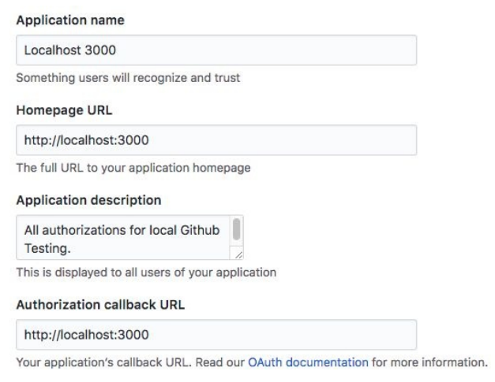
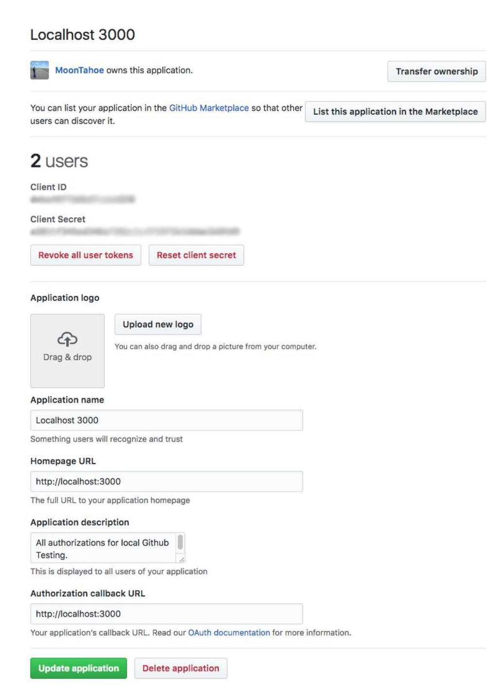
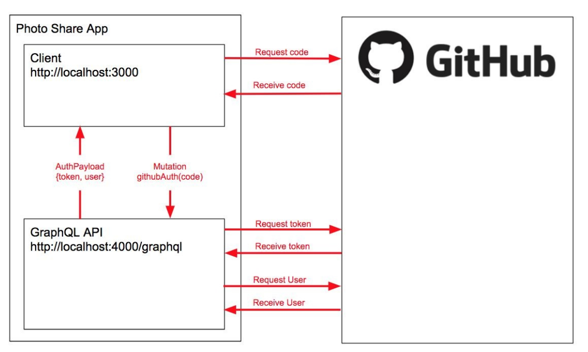

## GitHub 授权

授权和验证用户是任何应用程序的重要组成部分。我们可以使用多种策略来实现这一目标。社交授权是一种流行的授权，因为它将许多帐户管理细节留给了社交提供商。它还可以帮助用户在登录时感到更安全，因为社交提供商可能是他们已经习惯的服务。对于我们的应用程序，我们实施了 GitHub 授权，因为您很可能已经拥有 GitHub 帐户（如果您没有，也可以简单快捷地获得一个）。

### 设置 GitHub OAuth

在我们开始之前，您需要为这个应用程序设置 GitHub 授权才能工作。为此，请执行以下步骤：

1. 前往 https://www.github.com 并登录。
2. 前往账户设置。
3. 前往开发者设置。
4. 单击新建 OAuth 应用程序。
5. 添加如下设置（如图5-2所示）：
```
应用名称
    Localhost 3000
主页网址
    http://localhost:3000
应用说明
    本地 GitHub 测试的所有权限
授权回调地址
    http://localhost:3000
```

<p align="center">
  <br>
  图5-2 新的 OAuth APP<br>
</p>

6. 单击保存。
7. 转到 OAuth 帐户页面并获取您的 client_id 和 client_secret，如图 5-3 所示。

<p align="center">
  <br>
  图5-3 OAuth APP 设置<br>
</p>

完成此设置后，我们现在可以从 GitHub 获取授权令牌和有关用户的信息。具体来说，我们需要 client_id 和 client_secret。

### 授权过程

授权 GitHub 应用程序的过程发生在客户端和服务器上。在本节中，我们将讨论如何处理服务器，并在第 6 章中讨论客户端实现。如下图 5-4 所示，完整的授权过程发生在以下步骤中。粗体步骤表示本章在服务器上会发生什么： 

1. 客户端：使用带有 client_id 的 url 向 GitHub 请求代码 
2. 用户：允许客户端应用程序访问 GitHub 上的帐户信息 
3. GitHub：将代码发送到 OAuth 重定向网址：http://localhost:3000/
4. 客户端：发送 GraphQL Mutation githubAuth(code) 和代码 
5. API：请求 GitHub access_token，凭据：client_id、client_secret 和 client_code 
6. GitHub：响应 access_token，可用于未来的信息请求 
7. API：请求 使用 access_token 的用户信息 
8. GitHub：响应用户信息：姓名、githubLogin 和头像 
9. API：使用 AuthPayload 解决 authUser（代码）突变，其中包含令牌和用户 
10. 客户端：保存令牌，以进行接下来的 GraphQL 请求

<p align="center">
  <br>
  图5-4 授权过程<br>
</p>

为了实现 githubAuth 突变，我们假设我们有一个code 。我们使用code获取token后，将新用户信息和token保存到本地数据库中。我们还将将该信息返回给客户。客户端将在本地保存token，并在每次请求时将其发回给我们。我们将使用令牌授权用户并访问他们的数据记录。

### githubAuth 突变

我们通过使用 GitHub 变更来处理授权用户。在[第 4 章](/ch04_00.md)中，我们为我们的模式设计了一个自定义负载类型，称为 AuthPayload。让我们将 AuthPayload 和 githubAuth 突变添加到我们的 typeDef 中：

``` graphql
type AuthPayload {
  token: String!
  user: User!
}

type Mutation {
  ...
  githubAuth(code: String!): AuthPayload!
}
```

AuthPayload 类型仅用作对授权变更的响应。它包含由突变授权的用户以及他们可以在未来的请求中用来识别自己的令牌。

在编写 githubAuth 解析器之前，我们需要构建两个函数来处理 GitHub API 请求：

``` javascript
const requestGithubToken = (credentials) =>
  fetch("https://github.com/login/oauth/access_token", {
    method: "POST",
    headers: {
      "Content-Type": "application/json",
      Accept: "application/json",
    },
    body: JSON.stringify(credentials),
  })
    .then((res) => res.json())
    .catch((error) => {
      throw new Error(JSON.stringify(error));
    });
```

requestGithubToken 函数返回一个获取 promise。凭据将发送到 POST 请求正文中的 GitHub API URL。凭据由三部分组成：client_id、client_secret 和 code。完成后，GitHub 响应将被解析为 JSON。我们现在可以使用此函数来请求带有凭据的 GitHub 访问令牌。这个和未来的辅助函数可以在 [repo](https://github.com/MoonHighway/learning-graphql/blob/master/chapter-05/photo-share-api/lib.js/) 的 lib.js 文件中找到。

一旦我们有了 GitHub 令牌，我们就需要从当前用户的帐户访问信息。具体来说，我们需要他们的 GitHub 登录名、姓名和个人资料图片。要获取此信息，我们需要向 GitHub API 发送另一个请求以及我们从上一个请求中获取的访问令牌：

``` javascript
const requestGithubUserAccount = (token) =>
  fetch(`https://api.github.com/user?access_token=${token}`)
    .then(toJSON)
    .catch(throwError);
```

此函数还返回一个获取承诺。在这个 GitHub API 路由上，只要我们有访问令牌，我们就可以访问有关当前用户的信息。

现在，让我们将这两个请求组合成一个异步函数，我们可以用它来授权 GitHub 的用户：

``` javascript
async authorizeWithGithub(credentials) {
    const { access_token } = await requestGithubToken(credentials)
    const githubUser = await requestGithubUserAccount(access_token)
    return { ...githubUser, access_token }
  }
```

使用 async/await 使得处理多个异步请求成为可能。首先，我们请求访问令牌并等待响应。然后，使用 access_token，我们请求 GitHub 用户帐户信息并等待响应。获得数据后，我们会将它们全部放在一个对象中。

我们已经创建了支持解析器功能的辅助函数。现在，让我们实际编写解析器以从 GitHub 获取令牌和用户帐户：

``` javascript
async githubAuth(parent, { code }, { db }) {
  // 1. Obtain data from GitHub
  let {
    message,
    access_token,
    avatar_url,
    login,
    name
  } = await authorizeWithGithub({
    client_id: <YOUR_CLIENT_ID_HERE>,
    client_secret: <YOUR_CLIENT_SECRET_HERE>,
    code
  })
  // 2. If there is a message, something went wrong
  if (message) {
    throw new Error(message)
  }
  // 3. Package the results into a single object
  let latestUserInfo = {
    name,
    githubLogin: login,
    githubToken: access_token,
    avatar: avatar_url
  }
  // 4. Add or update the record with the new information
  const { ops:[user] } = await db
    .collection('users')
    .replaceOne({ githubLogin: login }, latestUserInfo, { upsert: true })
  // 5. Return user data and their token
  return { user, token: access_token }
}
```

解析器可以是异步的。我们可以在将操作结果返回给客户端之前等待网络响应。githubAuth 解析器是异步的，因为我们必须等待来自 GitHub 的两次响应，然后才能获得需要返回的数据。

从 GitHub 获取用户数据后，我们检查本地数据库以查看该用户过去是否登录过我们的应用程序，这意味着他们已经有一个帐户。如果用户有帐户，我们将使用从 GitHub 收到的信息更新他们的帐户详细信息。自上次登录后，他们可能更改了姓名或头像。如果他们还没有帐户，我们会将新用户添加到我们的用户集合中。在这两种情况下，我们都会从该解析器返回登录用户和令牌。

是时候测试这个授权过程了，要测试，你需要 code。要获取 code，您需要将您的客户端 ID 添加到此 URL：

```
https://github.com/login/oauth/authorize?client_id=YOUR-ID-HERE&scope=user
```

将带有 GitHub client_id 的 URL 粘贴到新浏览器窗口的地址栏中。您将被引导至 GitHub，您将在其中同意授权此应用程序。当您授权该应用程序时，GitHub 将使用 code 将您重定向回 http://localhost:3000/。

```
http://locahost:3000/?code=XYZ
```

在这里，code 是 XYZ。从浏览器 URL 复制代码，然后使用 githubAuth 突变发送它：

``` graphql
mutation {
  githubAuth(code: "XYZ") {
    token
    user {
      githubLogin
      name
      avatar
    }
  }
}
```

此变更将授权当前用户并返回一个令牌以及有关该用户的信息。保存令牌。我们需要在未来的请求中将其放到请求头中。

> _**无效的凭证**_  
> 当您看到错误“Bad Credentials”时，表示发送到 GitHub API 的客户端 ID、客户端密码或代码不正确。检查client ID和client secret以确保正确； 通常是 code 导致此错误。
> 
> GitHub code 仅在有限的时间段内有效，并且只能使用一次。如果在请求凭据后解析器中存在错误，则请求中使用的代码将不再有效。通常，您可以通过从 GitHub 请求另一个 code 来解决此错误。

### 验证用户

为了在以后的请求中识别您自己，您需要在 Authorization 标头中的每个请求中发送您的令牌。该令牌将用于通过查找他们的数据库记录来识别用户。

GraphQL Playground 有一个位置，您可以在其中为每个请求添加标头。在底角，“查询变量”旁边有一个名为“HTTP 标头”的选项卡。您可以使用此选项卡将 HTTP 标头添加到您的请求中。只需将标头作为 JSON 发送：

``` json
{
  "Authorization": "<YOUR_TOKEN>"
}
```

将 \<YOUR_TOKEN> 替换为从 githubAuth 突变返回的令牌。现在，您将通过每个 GraphQL 请求发送您的身份识别密钥。我们需要使用该密钥找到您的帐户并将其添加到上下文中。

#### 查询自己

从这里开始，我们要创建一个查询来引用我们自己的用户信息：查询自己。此查询根据请求的 HTTP 标头中发送的令牌返回当前登录的用户。如果当前没有登录用户，查询将返回 null。

当客户端发送带有授权的 GraphQL 查询自己时，该过程开始：用于安全用户信息的令牌。然后，API 会捕获授权标头并使用令牌在数据库中查找当前用户记录。它还将当前用户帐户添加到上下文中。在上下文中之后，每个解析器都可以访问当前用户。

由我们来识别当前用户并将他们置于上下文中。让我们修改服务器的配置。我们需要改变构建上下文对象的方式。我们将使用函数来代替对象来处理上下文：

``` javascript
async function start() {
  const app = express();
  const MONGO_DB = process.env.DB_HOST;
  const client = await MongoClient.connect(MONGO_DB, { useNewUrlParser: true });
  const db = client.db();
  const server = new ApolloServer({
    typeDefs,
    resolvers,
    context: async ({ req }) => {
      const githubToken = req.headers.authorization;
      const currentUser = await db.collection("users").findOne({ githubToken });
      return { db, currentUser };
    },
  });
  ...
}
```

上下文可以是对象或函数。为了让我们的应用程序正常工作，我们需要它是一个函数，以便我们可以在每次有请求时设置上下文。当 context 是一个函数时，它会为每个 GraphQL 请求调用。此函数返回的对象是发送到解析器的上下文。

在上下文函数中，我们可以从请求中捕获授权标头并将其解析为令牌。获得令牌后，我们可以使用它在数据库中查找用户。如果我们有一个用户，他们将被添加到上下文中。否则，上下文中用户的值将为空。

有了这段代码，就可以添加查询了。首先，我们需要修改我们的 typeDef：

``` graphql
type Query {
  me: User
  ...
}
```

查询返回一个可为 null 的用户。如果未找到当前授权用户，它将为空。让我们为查询添加解析器：

``` javascript
const resolvers = {
  Query: {
    me: (parent, args, { currentUser }) => currentUser,
    ...
  }
}
```

我们已经完成了根据令牌查找用户的繁重工作。此时，您只需从上下文中返回 currentUser 对象。同样，如果没有用户，这将为 null。

如果正确的令牌已添加到 HTTP 授权标头，您可以发送请求以查询获取有关您自己的详细信息：

``` graphql
query currentUser {
  me {
    githubLogin
    name
    avatar
  }
}
```

当您运行此查询时，您将被识别身份。确认一切正确的一个很好的测试是尝试在没有授权标头或不正确的令牌的情况下运行此查询。给定错误的标记或缺少标头，您应该会看到查询返回的结果为空。

#### postPhoto 突变

要将照片发布到我们的应用程序，用户必须登录。postPhoto 突变可以通过检查上下文来确定谁已登录。让我们修改 postPhoto 突变：

``` javascript
async postPhoto(parent, args, { db, currentUser }) {
  // 1. If there is not a user in context, throw an error
  if (!currentUser) {
    throw new Error('only an authorized user can post a photo')
  }
  // 2. Save the current user's id with the photo
  const newPhoto = {
    ...args.input,
    userID: currentUser.githubLogin,
    created: new Date()
  }
  // 3. Insert the new photo, capture the id that the database created
  const { insertedIds } = await db.collection('photos').insert(newPhoto)
  newPhoto.id = insertedIds[0]
  return newPhoto
}
```

为了将新照片保存到数据库，postPhoto 突变经历了几次更改。首先，currentUser 是从上下文中获取的。如果此值为 null，我们将抛出错误并阻止 postPhoto 突变进一步执行。要发布照片，用户必须在授权标头中发送正确的令牌。

接下来，我们将当前用户的 ID 添加到 newPhoto 对象。现在，我们可以将新的照片记录保存到数据库中的照片集中。Mongo 为它保存的每个文档创建一个唯一标识符。添加新照片后，我们可以使用 insertedIds 数组获取该标识符。在我们返回照片之前，我们需要确保它有一个唯一的标识符。

我们还需要更改照片解析器：

``` javascript
const resolvers = {
  ...
  Photo: {
    id: parent => parent.id || parent._id,
    url: parent => `/img/photos/${parent._id}.jpg`,
    postedBy: (parent, args, { db }) =>
    db.collection('users').findOne({ githubLogin: parent.userID })
  }
}
```

首先，如果客户端要求提供照片 ID，我们需要确保它收到正确的值。如果照片还没有 ID，我们可以假设已经为照片创建了一条数据库记录，并且它将在字段 _id 下保存一个 ID。我们需要确保照片的 ID 字段解析为数据库 ID。

接下来，假设我们从同一个网络服务器提供这些照片。我们将本地路由返回到照片。这条本地路由是使用照片的 ID 创建的。

最后，我们需要修改 postedBy 解析器以在数据库中查找发布照片的用户。我们可以使用与照片一起保存的用户 ID 在数据库中查找该用户的记录。照片的 userID 应该与用户 githubLogin 匹配，所以 .findOne() 方法应该返回一条用户记录，即发布照片的用户。

有了我们的授权标头，我们应该能够将新照片发布到 GraphQL 服务：

``` graphql
mutation post($input: PostPhotoInput!) {
  postPhoto(input: $input) {
    id
    url
    postedBy {
      name
      avatar
    }
  }
}
```

发布照片后，我们可以请求其 id 和 url，以及发布照片的用户的姓名和头像。

#### 添加假用户突变

为了用我们以外的用户测试我们的应用程序，我们将添加一个突变，允许我们使用来自 random.me API 的假用户填充数据库。

我们可以用一个叫做 addFakeUsers 的突变来处理这个问题。让我们首先将其添加到架构中：

``` graphql
type Mutation {
  addFakeUsers(count: Int = 1): [User!]!
  ...
}
```

请注意，count 参数接受要添加的虚假用户的数量并返回用户列表。此用户列表包含此突变添加的虚假用户的帐户。默认情况下，我们一次添加一个用户，但您可以通过向此突变发送不同的计数来添加更多用户：

``` javascript
addFakeUsers: async (root, { count }, { db }) => {
  var randomUserApi = `https://randomuser.me/api/?results=${count}`;
  var { results } = await fetch(randomUserApi).then((res) => res.json());
  var users = results.map((r) => ({
    githubLogin: r.login.username,
    name: `${r.name.first} ${r.name.last}`,
    avatar: r.picture.thumbnail,
    githubToken: r.login.sha1,
  }));
  await db.collection("users").insert(users);
  return users;
};
```

为了测试添加新用户，首先我们要从 randomuser.me 获取一些假数据。addFakeUsers 是一个异步函数，我们可以使用它来获取该数据。然后，我们序列化来自 randomuser.me 的数据，创建与我们的模式匹配的用户对象。接下来，我们将这些新用户添加到数据库中并返回新用户列表。

现在，我们可以用一个突变来填充数据库：

``` graphql
mutation {
  addFakeUsers(count: 3) {
    name
  }
}
```

此突变将三个假用户添加到数据库中。现在我们有了假用户，我们还想通过突变使用假用户帐户登录。让我们在 Mutation 类型中添加一个 fakeUserAuth：

``` graphql
type Mutation {
  fakeUserAuth(githubLogin: ID!): AuthPayload!
  ...
}
```

接下来，我们需要添加一个解析器，它返回一个令牌，我们可以用它来授权我们的假用户：

``` javascript
async fakeUserAuth (parent, { githubLogin }, { db }) {
  var user = await db.collection('users').findOne({ githubLogin })
  if (!user) {
    throw new Error(`Cannot find user with githubLogin "${githubLogin}"`)
  }
  return {
    token: user.githubToken,
    user
  }
}
```

fakeUserAuth 解析器从突变的参数中获取 githubLogin，并使用它在数据库中查找该用户。找到该用户后，该用户的令牌和用户帐户将以我们的 AuthPayload 类型的形式返回。

现在我们可以通过发送突变来验证假用户：

``` graphql
mutation {
  fakeUserAuth(githubLogin:"jDoe") {
    token
  }
}
```

将返回的令牌添加到授权 HTTP 头以使用该假用户的身份发布新照片。

| :point_left: [上一节](/ch05_04.md) | [下一节](/ch05_06.md) :point_right: |
| - | - |
