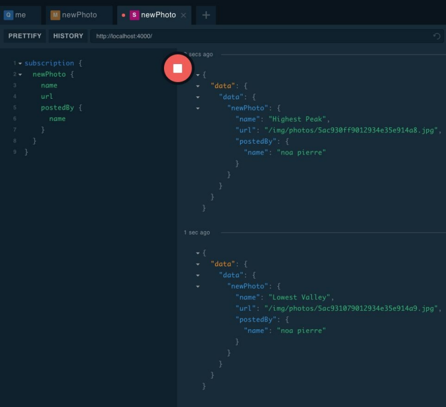

## 订阅

实时更新是现代网络和移动应用程序的基本功能。当前允许在网站和移动应用程序之间进行实时数据传输的技术是 WebSocket。您可以使用 WebSocket 协议通过 TCP 套接字打开双工双向通信通道。这意味着网页和应用程序可以通过单个连接发送和接收数据。该技术允许更新从服务器直接实时推送到网页。

到目前为止，我们已经使用 HTTP 协议实现了 GraphQL 查询和变更。HTTP 为我们提供了一种在客户端和服务器之间发送和接收数据的方法，但它并不能帮助我们连接到服务器并监听状态变化。在引入 WebSockets 之前，监听服务器状态变化的唯一方法是递增地向服务器发送 HTTP 请求以确定是否有任何变化。我们在[第 6 章](/ch06_00.md)中了解了如何使用查询标签轻松实现轮询。

但是如果我们真的想充分利用新 Web，除了 HTTP 请求之外，GraphQL 还必须能够支持通过 WebSockets 进行的实时数据传输。解决方案是订阅。让我们来看看如何在 GraphQL 中实现订阅。

### 使用订阅

在 GraphQL 中，您使用订阅来监听您的 API 以了解特定的数据更改。Apollo Server 已经支持订阅。它包装了几个通常用于在 GraphQL 应用程序中设置 WebSockets 的 npm 包：graphql-subscriptions 和 subscriptions-transport-ws。graphql-subscriptions 包是一个 npm 包，它提供了发布者/订阅者设计模式 PubSub 的实现。PubSub 对于发布客户端订阅者可以使用的数据更改至关重要。subscriptions-transport-ws 是一个 WebSocket 服务器和客户端，允许通过 WebSockets 传输订阅。Apollo Server 自动合并这两个包以支持开箱即用的订阅。

默认情况下，Apollo Server 在 ws://localhost:4000 设置了一个 WebSocket。如果您使用我们在[第 5 章](/ch05_00.md)开头演示的简单服务器配置，那么您使用的是开箱即用的支持 WebSockets 的配置。

因为我们正在使用 apollo-server-express，所以我们必须采取一些步骤来使订阅工作。在 photo-share-api 中找到 index.js 文件，并从 http 模块中导入 createServer 函数：

``` javascript
const { createServer } = require('http')
```

Apollo Server 将自动设置订阅支持，但为此需要一个 HTTP 服务器。我们将使用 createServer 创建一个。找到启动函数底部的代码，其中使用 app.listen(...) 在特定端口上启动 GraphQL 服务。将此代码替换为以下内容：

``` javascript
const httpServer = createServer(app);
server.installSubscriptionHandlers(httpServer);
httpServer.listen({ port: 4000 }, () =>
  console.log(`GraphQL Server running at localhost:4000${server.graphqlPath}`)
);
```

首先，我们使用 Express 应用程序实例创建一个新的 httpServer。httpServer 已准备好根据我们当前的 Express 配置处理发送给它的所有 HTTP 请求。我们还有一个服务器实例，我们可以在其中添加 WebSocket 支持。下一行代码 ```server.installSubscriptionHandlers(httpServer)``` 是使 WebSocket 工作的原因。这是 Apollo Server 添加必要的处理程序以支持使用 WebSockets 订阅的地方。除了 HTTP 服务器之外，我们的后端现在已准备好在 ws://localhost:4000/graphql 接收请求。

现在我们有一个准备好支持订阅的服务器，是时候实现它们了。

#### 发布照片

我们想知道我们的任何用户何时发布照片。这是订阅的一个很好的用例。就像 GraphQL 中的其他所有内容一样，要实现订阅，我们需要先从模式开始。让我们在 Mutation 类型的定义下方的模式中添加一个订阅类型：

``` graphql
type Subscription {
  newPhoto: Photo!
}
```

添加照片时，newPhoto 订阅将用于向客户端推送数据。我们使用以下 GraphQL 查询语言操作发送订阅操作：

``` graphql
subscription {
  newPhoto {
    url
    category
    postedBy {
      githubLogin
      avatar
    }
  }
}
```

此订阅会将有关新照片的数据推送到客户端。就像 Query 或 Mutation 一样，GraphQL 允许我们使用选择集请求有关特定字段的数据。通过此订阅，每次有新照片时，我们将收到其 url 和类别以及发布此照片的用户的 githubLogin 和头像。

当订阅发送到我们的服务时，连接保持打开状态。它正在监听数据变化。添加的每张照片都会将数据推送给订阅者。如果您使用 GraphQL Playground 设置订阅，您会注意到“播放”按钮将变为红色的“停止”按钮。

Stop 按钮表示订阅当前处于打开状态并正在侦听数据。当您按下停止按钮时，订阅将被取消订阅。它将停止监听数据变化。

终于到了查看 postPhoto 突变的时候了：将新照片添加到数据库的突变。我们想从这个突变中向我们的订阅发布新的照片细节：

``` javascript
async postPhoto(root, args, { db, currentUser, pubsub }) {
  if (!currentUser) {
    throw new Error('only an authorized user can post a photo')
  }

  const newPhoto = {
    ...args.input,
    userID: currentUser.githubLogin,
    created: new Date()
  }

  const { insertedIds } = await db.collection('photos').insert(newPhoto)
  newPhoto.id = insertedIds[0]
  
  pubsub.publish('photo-added', { newPhoto })
  
  return newPhoto
}
```

此解析器期望已将 pubsub 实例添加到上下文中。我们将在下一步中这样做。pubsub 是一种可以发布事件并将数据发送到我们的订阅解析器的机制。它就像 Node.js 的 EventEmitter。您可以使用它来发布事件并将数据发送到已订阅事件的每个处理程序。在这里，我们在将新照片插入数据库后立即发布照片添加事件。新照片的详细信息作为 pubsub.publish 方法的第二个参数传递。这会将有关新照片的详细信息传递给已订阅照片添加事件的每个处理程序。

接下来，让我们添加将用于订阅 photoadded 事件的订阅解析器：

``` javascript
const resolvers = {
  ...
  Subscription: {
    newPhoto: {
      subscribe: (parent, args, { pubsub }) =>
        pubsub.asyncIterator('photo-added')
    }
  }
}
```

订阅解析器是根解析器。它应该直接添加到 Query 和 Mutation 解析器旁边的解析器对象中。在订阅解析器中，我们需要为每个字段定义解析器。因为我们在我们的模式中定义了 newPhoto 字段，所以我们需要确保我们的解析器中存在一个 newPhoto 解析器。

与查询或突变解析器不同，订阅解析器包含一个订阅方法。subscribe 方法像任何其他解析器函数一样接收 parent、args 和 context。在此方法内部，我们订阅特定事件。在这种情况下，我们使用 pubsub.asyncIterator 来订阅 photoadded 事件。任何时候 pubsub 引发添加照片的事件，都会通过这个新的照片订阅传递。

> _**Repo 中的订阅解析器**_  
> GitHub 存储库中的示例文件将解析器分解为多个文件。上面的代码可以在 resolvers/Subscriptions.js 中找到。

postPhoto 解析器和 newPhoto 订阅解析器都希望上下文中有一个 pubsub 实例。让我们修改上下文以包含 pubsub。找到 index.js 文件并进行以下更改：

``` javascript
const { ApolloServer, PubSub } = require('apollo-server-express')
...
async function start() {
  ...
  const pubsub = new PubSub()
  const server = new ApolloServer({
    typeDefs,
    resolvers,
    context: async ({ req, connection }) => {
      const githubToken = req ?
        req.headers.authorization :
        connection.context.Authorization

      const currentUser = await db
        .collection('users')
        .findOne({ githubToken })
        return { db, currentUser, pubsub }
    }
  })
  ...
}
```

首先，我们需要从 apollo-server-express 包中导入 PubSub 构造函数。我们使用此构造函数创建一个 pubsub 实例并将其添加到上下文中。

您可能还注意到我们更改了上下文函数。查询和变更仍将使用 HTTP。当我们将这些操作中的任何一个发送到 GraphQL 服务时，请求参数 req 被发送到上下文处理程序。但是，当操作是订阅时，没有 HTTP 请求，因此 req 参数为空。当客户端连接到 WebSocket 时，会传递订阅信息。在这种情况下，WebSocket 连接参数将改为发送到上下文函数。当我们有一个订阅时，我们必须通过连接的上下文传递授权细节，而不是 HTTP 请求标头。

现在我们已准备好试用我们的新订阅。打开 playground 并开始订阅：

``` graphql
subscription {
  newPhoto {
    name
    url
    postedBy {
      name
    }
  }
}
```

订阅运行后，打开一个新的 Playground 选项卡并运行 postPhoto 突变。每次运行此突变时，您都会看到发送到订阅的新照片数据。

<p align="center">
  <br>
  图7-1 playground 中的新照片订阅<br>
</p>

> _**挑战：新用户订阅**_  
> 你能实现一个新的用户订阅吗？ 每当通过 githubLogin 或 addFakeUsers 突变将新用户添加到数据库时，您可以将新用户事件发布到订阅吗？ 
> 提示：在处理 addFakeUsers 时，您可能需要多次发布事件，每添加一个用户一次。
> 如果你遇到困难，你可以在 [repo](https://github.com/MoonHighway/learning-graphql/tree/master/chapter-07) 中找到答案。

### 消费订阅

假设您完成了前面边栏中的挑战，PhotoShare 服务器支持订阅照片和用户。在下一节中，我们订阅 newUser 订阅并立即在页面上显示任何新用户。在开始之前，我们需要设置 Apollo Client 来处理订阅。

#### 添加 WebSocketLink

订阅通过 WebSockets 使用。要在服务器上启用 WebSockets，我们需要安装一些额外的包：

```
npm install apollo-link-ws apollo-utilities subscription-transport-ws
```

从这里开始，我们要向 Apollo Client 配置添加一个 WebSocket 链接。在 photo-share-client 项目中找到 src/index.js 文件并添加以下导入：

``` javascript
import {
  InMemoryCache,
  HttpLink,
  ApolloLink,
  ApolloClient,
  split
} from 'apollo-boost'
import { WebSocketLink } from 'apollo-link-ws'
import { getMainDefinition } from 'apollo-utilities'
```

请注意，我们已经从 apollo-boost 导入了 split。我们将使用它在 HTTP 请求和 WebSockets 之间拆分 GraphQL 操作。如果操作是突变或查询，Apollo Client 将发送一个 HTTP 请求。如果操作是订阅，客户端将连接到 WebSocket。在 Apollo Client 的底层，网络请求是通过 ApolloLink 管理的。在当前的应用程序中，它负责向 GraphQL 服务发送 HTTP 请求。每当我们使用 Apollo 客户端发送操作时，该操作都会发送到 Apollo Link 以处理网络请求。我们还可以使用 Apollo Link 来处理 WebSocket 上的网络。

我们需要设置两种类型的链接来支持 WebSockets：HttpLink 和 WebsocketLink：

``` javascript
const httpLink = new HttpLink({ uri: 'http://localhost:4000/graphql' })
const wsLink = new WebSocketLink({
  uri: `ws://localhost:4000/graphql`,
  options: { reconnect: true }
})
```

httpLink 可用于通过网络向 http://localhost:4000/graphql 发送 HTTP 请求，而 wsLink 可用于连接到 ws://localhost:4000/graphql 并通过 WebSockets 使用数据。

链接是可组合的。这意味着它们可以链接在一起，为我们的 GraphQL 操作构建自定义管道。除了能够将操作发送到单个 ApolloLink 之外，我们还可以通过可重用链接链发送操作，其中链中的每个链接都可以在操作到达链中处理请求并返回的最后一个链接之前对其进行操作 结果。

让我们通过添加负责将授权标头添加到操作的自定义 Apollo 链接来使用 httpLink 创建链接链：

``` javascript
const authLink = new ApolloLink((operation, forward) => {
  operation.setContext((context) => ({
    headers: {
      ...context.headers,
      authorization: localStorage.getItem("token"),
    },
  }));
  return forward(operation);
});

const httpAuthLink = authLink.concat(httpLink);
```

httpLink 连接到 authLink 以处理 HTTP 请求的用户授权。请记住，这个 .concat 函数与您在 JavaScript 中找到的连接数组的函数不同。这是一个连接 Apollo Links 的特殊函数。连接后，我们更恰当地将链接命名为 httpAuthLink 以更清楚地描述行为。当一个操作被发送到这个链接时，它会首先被传递到 authLink ，在它被转发到 httpLink 处理网络请求之前，授权头被添加到操作中。如果您熟悉 Express 或 Redux 中的中间件，则模式类似。

现在我们需要告诉客户端使用哪个链接。这就是 split 派上用场的地方。split 函数将返回基于谓词的两个 Apollo 链接之一。split 函数的第一个参数是谓词。谓词是返回 true 或 false 的函数。split函数的第二个参数表示谓词返回真时返回的链接，第三个参数表示谓词返回假时返回的链接。

让我们实现一个拆分链接，它将检查我们的操作是否恰好是订阅。如果是订阅，我们将使用 wsLink 来处理网络，否则我们将使用 httpLink：

``` javascript
const link = split(
  ({ query }) => {
    const { kind, operation } = getMainDefinition(query);
    return kind === "OperationDefinition" && operation === "subscription";
  },
  wsLink,
  httpAuthLink
);
```

第一个参数是谓词函数。它将使用 getMainDefinition 函数检查操作的查询 AST。如果此操作是订阅，那么我们的谓词将返回 true。当谓词返回 true 时，链接将返回 wsLink。当谓词返回 false 时，链接将返回 httpAuthLink。

最后，我们需要更改我们的 Apollo Client 配置以通过将链接和缓存传递给它来使用我们的自定义链接：

``` javascript
const client = new ApolloClient({ cache, link })
```

现在我们的客户端已准备好处理订阅。在下一节中，我们将使用 Apollo Client 发送我们的第一个订阅操作。

#### 监听新用户

在客户端，我们可以通过创建一个名为 LISTEN_FOR_USERS 的常量来监听新用户。这包含一个带有我们订阅的字符串，它将返回新用户的 githubLogin、名称和头像：

``` javascript
const LISTEN_FOR_USERS = gql`
  subscription {
    newUser {
      githubLogin
      name
      avatar
    }
  }
`;
```

然后，我们可以使用 \<Subscription /> 组件来监听新用户：

``` javascript
<Subscription subscription={LISTEN_FOR_USERS}>
  {
    ({ data, loading }) => loading ?
    <p>loading a new user...</p> :
    <div>
      
      <h2>{data.newUser.name}</h2>
    </div>
  }
</Subscription>
```

正如您在此处看到的，\<Subscription /> 组件的工作方式类似于 \<Mutation /> 或 \<Query /> 组件。您将订阅发送给它，当收到新用户时，他们的数据将传递给一个函数。在我们的应用程序中使用此组件的问题是 newUser 订阅一次传递一个新用户。因此，前面的组件将仅显示最后创建的新用户。

我们想要做的是在 PhotoShare 客户端启动时监听新用户，当我们有新用户时，我们将他们添加到我们当前的本地缓存中。当缓存更新时，UI 将随之更新，因此无需为新用户更改 UI 的任何内容。

让我们修改 App 组件。首先，我们将其转换为类组件，以便我们可以利用 React 的组件生命周期。当组件安装时，我们开始通过我们的订阅监听新用户。当 App 组件卸载时，我们通过调用订阅的取消订阅方法停止监听：

``` javascript
import { withApollo } from "react-apollo";
...
class App extends Component {
  componentDidMount() {
    let { client } = this.props;
    this.listenForUsers = client
      .subscribe({ query: LISTEN_FOR_USERS })
      .subscribe(({ data: { newUser } }) => {
        const data = client.readQuery({ query: ROOT_QUERY });
        data.totalUsers += 1;
        data.allUsers = [...data.allUsers, newUser];
        client.writeQuery({ query: ROOT_QUERY, data });
      });
  }
  componentWillUnmount() {
    this.listenForUsers.unsubscribe();
  }
  render() {
    ...
  }
}
export default withApollo(App);
```

当我们导出 \<App /> 组件时，我们使用 withApollo 函数将客户端通过 props 传递给 App。当组件挂载时，我们将使用客户端开始监听新用户。当组件卸载时，我们使用 unsubscribe 方法停止订阅。

订阅是使用 client.subscribe().subscribe() 创建的。第一个订阅函数是一个 Apollo Client 方法，用于将订阅操作发送到我们的服务。它返回一个观察者对象。第二个订阅函数是观察者对象的一个方法。它用于将处理程序订阅到观察者。每次订阅将数据推送到客户端时都会调用处理程序。在上面的代码中，我们添加了一个处理程序来捕获有关每个新用户的信息，并使用 writeQuery 将它们直接添加到 Apollo 缓存中。

现在，当添加新用户时，他们会立即被推送到我们的本地缓存中，从而立即更新 UI。因为订阅会实时将每个新用户添加到列表中，所以不再需要从 src/Users.js 更新本地缓存。在此文件中，您应该删除 updateUserCache 函数以及突变的更新属性。您可以在[本书的网站](https://github.com/MoonHighway/learning-graphql/tree/master/chapter-07/photo-share-client)上看到应用程序组件的完整版本。

| :point_left: [上一节](/ch07_00.md) | [下一节](/ch07_02.md) :point_right: |
| - | - |
